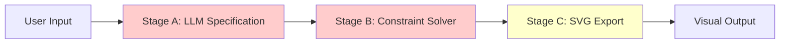
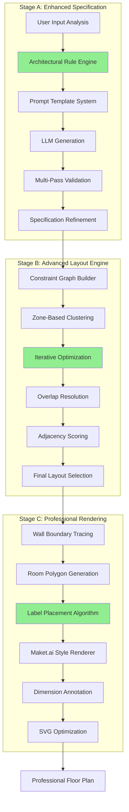
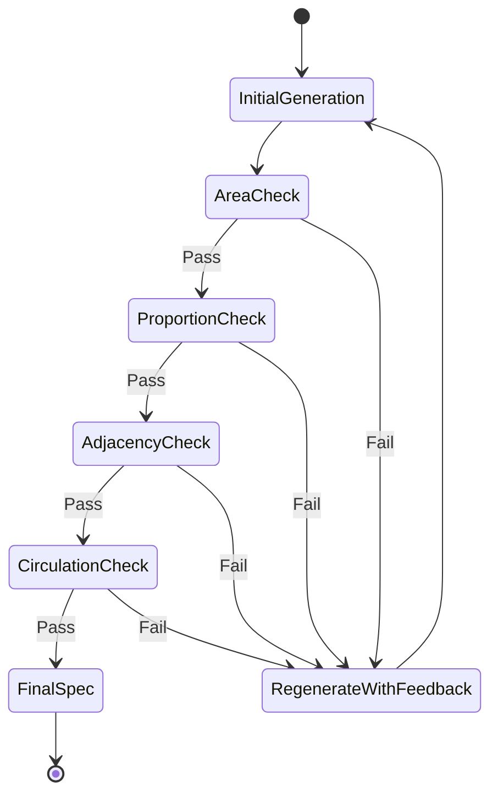
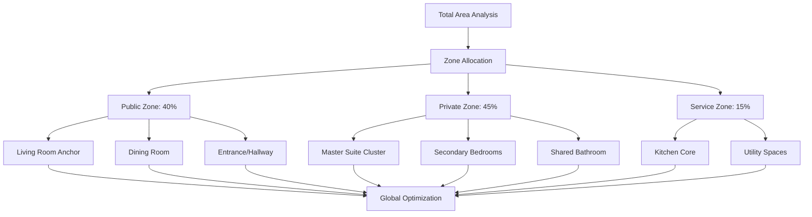
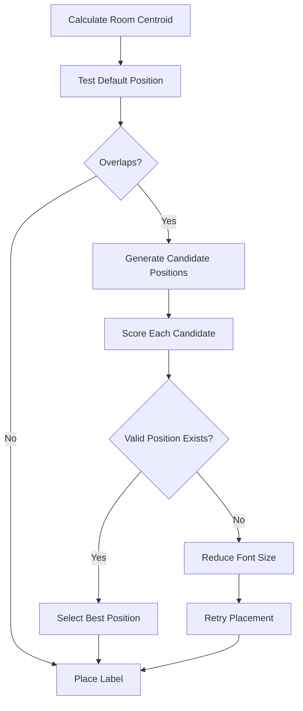

# AI Floor Plan Generation Quality Optimization

## Overview

This design outlines a comprehensive strategy to improve the visual quality, architectural accuracy, and user satisfaction of AI-generated floor plans. The current system produces floor plans with issues including overlapping room labels, poor spatial layout, inconsistent room proportions, and lack of professional architectural standards.

The optimization targets three critical areas:
- **Stage A Enhancement**: Improve LLM prompt engineering and specification quality
- **Stage B Refinement**: Advanced constraint solving and spatial optimization
- **Stage C Elevation**: Professional-grade SVG rendering and visual design

## Architecture

### Current Pipeline Analysis



**Identified Issues:**
- **Stage A**: Insufficient architectural constraints, vague room specifications
- **Stage B**: Simplistic placement algorithm causing overlaps and poor adjacency
- **Stage C**: Basic rendering lacking professional polish

### Proposed Enhanced Architecture



## Stage A: Enhanced Specification Generation

### Improved Prompt Engineering Strategy

#### Architectural Rule Integration

The LLM must receive strict architectural guidelines embedded directly in the prompt:

**Room Proportion Standards:**

| Room Type | Min Area (m²) | Max Area (m²) | Optimal Ratio | Min Dimension (m) |
|-----------|---------------|---------------|---------------|-------------------|
| Master Bedroom | 12 | 25 | 1.2:1 | 3.5 |
| Bedroom | 9 | 16 | 1.3:1 | 3.0 |
| Living Room | 18 | 40 | 1.5:1 | 4.0 |
| Kitchen | 8 | 18 | 1.4:1 | 2.5 |
| Bathroom | 3.5 | 8 | 1.2:1 | 1.8 |
| Hallway | 2 | 8 | 0.4:1 | 1.2 |

**Mandatory Adjacency Rules:**

| Room Pair | Relationship | Weight | Justification |
|-----------|-------------|--------|---------------|
| Kitchen ↔ Dining | Must Adjacent | 10 | Functional workflow |
| Master Bedroom ↔ Ensuite | Direct Connection | 10 | Privacy and convenience |
| Living ↔ Entrance | High Priority | 9 | Primary access |
| Bathroom ↔ Hallway | Strong Preference | 8 | Privacy buffer |
| Bedrooms ↔ Living | Avoid Direct | 2 | Privacy zoning |

#### Multi-Pass Validation Framework



**Validation Criteria:**

1. **Total Area Compliance**: Sum of room areas must be 75-85% of total area (remaining 15-25% for walls and circulation)
2. **Individual Room Validity**: Each room area within min/max bounds and aspect ratio constraints
3. **Adjacency Feasibility**: High-weight adjacencies (≥8) must be geometrically achievable
4. **Circulation Requirements**: Hallway presence validated for layouts with ≥4 rooms
5. **Zone Separation**: Private zones must not directly connect to public entrance

#### Enhanced Prompt Template

The prompt must include:

**Section 1: Architectural Context**
- Building typology classification (apartment, villa, townhouse)
- Cultural and regional design patterns
- Accessibility standards (door widths, circulation space)

**Section 2: Detailed Room Specifications**
- Precise dimensional constraints (not just area)
- Functional requirements (natural light, ventilation)
- Furniture clearance zones (e.g., bed requires 0.6m clearance)

**Section 3: Spatial Relationships**
- Primary circulation paths
- Zone-based grouping (public/private/service)
- View corridors and sight lines

**Section 4: Quality Metrics**
- Compactness score (perimeter-to-area ratio)
- Natural light coverage percentage
- Circulation efficiency ratio

### Specification Output Enhancement

**Current Format Issues:**
- Vague area ranges allowing poor optimization
- Missing dimensional constraints
- Weak adjacency weights

**Proposed Enhanced Format:**

```
Room Specification Schema:
{
  "id": "master_bedroom",
  "type": "bedroom",
  "areaConstraints": {
    "min": 14,
    "target": 16,
    "max": 20
  },
  "dimensionalConstraints": {
    "minWidth": 3.5,
    "minLength": 4.0,
    "aspectRatio": { "min": 1.1, "max": 1.4 }
  },
  "functionalRequirements": {
    "naturalLight": "required",
    "ventilation": "cross-ventilation-preferred",
    "furnitureZones": [
      { "type": "bed", "clearance": 0.6, "wallPlacement": true },
      { "type": "wardrobe", "clearance": 0.7 }
    ]
  },
  "spatialPreferences": {
    "exteriorWall": true,
    "cornerLocation": "preferred",
    "quietZone": true
  }
}
```

## Stage B: Advanced Constraint Solving

### Current Solver Limitations

**Identified Problems:**
1. **Greedy Placement**: Rooms placed sequentially without global optimization
2. **Weak Adjacency Enforcement**: High-weight adjacencies often violated
3. **Overlap Resolution**: Poor handling of placement conflicts
4. **Aspect Ratio Drift**: Rooms become too narrow or too wide
5. **Limited Backtracking**: Stuck in local minima

### Enhanced Solver Strategy

#### Zone-Based Hierarchical Placement



**Zone-Based Algorithm Flow:**

| Step | Action | Optimization Goal |
|------|--------|-------------------|
| 1 | Allocate zones by percentage | Balanced distribution |
| 2 | Place anchor rooms (living, master) | Maximize exterior wall access |
| 3 | Cluster dependent rooms (ensuite, kitchen-dining) | Satisfy must-adjacent constraints |
| 4 | Fill secondary rooms | Optimize remaining adjacencies |
| 5 | Add circulation spaces | Minimize hallway area |
| 6 | Global refinement | Improve compactness and alignment |

#### Multi-Objective Optimization Scoring

**Objective Function:**

```
Total Score = 
  0.35 × Area Compliance Score +
  0.30 × Adjacency Satisfaction Score +
  0.15 × Compactness Score +
  0.10 × Alignment Score +
  0.10 × Natural Light Score
```

**Scoring Components:**

1. **Area Compliance Score**
   - Measure deviation from target areas
   - Penalty for violating min/max bounds
   - Reward for aspect ratio compliance

2. **Adjacency Satisfaction Score**
   - Weight-based scoring (must=10, should=7-9, neutral=3-6)
   - Manhattan distance between room centroids
   - Shared wall length bonus

3. **Compactness Score**
   - Reward square/rectangular building footprints
   - Penalize irregular shapes and long corridors
   - Formula: `4π × Area / Perimeter²`

4. **Alignment Score**
   - Reward grid-aligned walls
   - Bonus for rooms sharing wall lines
   - Penalty for fragmented layouts

5. **Natural Light Score**
   - Percentage of rooms touching exterior walls
   - Bonus for optimal window placement zones

#### Iterative Refinement with Simulated Annealing

**Algorithm Approach:**

1. **Initial Solution**: Generate base layout using zone-based placement
2. **Perturbation**: Apply random modifications:
   - Swap room positions
   - Adjust room dimensions within constraints
   - Rotate room clusters
   - Shift adjacency priorities
3. **Acceptance Criteria**: 
   - Always accept better solutions
   - Accept worse solutions with probability `exp(-ΔScore / Temperature)`
4. **Cooling Schedule**: Reduce temperature gradually over iterations
5. **Convergence**: Stop when no improvement for N iterations

**Iteration Budget:**

| Layout Complexity | Iterations | Perturbations per Iteration |
|-------------------|------------|----------------------------|
| Simple (≤4 rooms) | 200 | 5 |
| Medium (5-8 rooms) | 500 | 8 |
| Complex (≥9 rooms) | 1000 | 12 |

### Overlap Resolution Strategy

**Current Issue**: Rooms placed without checking overlap constraints

**Enhanced Approach**:

1. **Strict Collision Detection**: Check room rectangles and wall boundaries
2. **Clearance Margins**: Enforce 0.1m minimum separation
3. **Conflict Resolution Priority**:
   - Higher priority rooms (living, master) retain positions
   - Lower priority rooms adjust or relocate
4. **Fallback Mechanism**: If placement fails after max attempts, reduce room area by 5% and retry

## Stage C: Professional Visual Rendering

### Maket.ai Style Compliance

**Visual Standard Requirements:**

| Element | Specification |
|---------|--------------|
| Walls | Bold black (#000000), 6px stroke weight |
| Room Fill | Pure white (#FFFFFF) |
| Room Labels | Centered, 13px Arial Bold, black (#1a1a1a) |
| Area Labels | Below room name, 10px Arial, gray (#666666) |
| Doors | Black door arc, dashed line (3,3 pattern), 2px stroke |
| Windows | Thin black lines, 3px stroke, no fill |
| Furniture | Geometric symbols (rectangles/circles), black stroke, no emoji |
| Background | Pure white, no grid |
| Padding | 15px minimum from walls to canvas edge |

### Intelligent Label Placement Algorithm

**Problem**: Overlapping labels when rooms are close together

**Solution - Collision-Free Label Positioning:**



**Candidate Position Strategy:**

For each room label, test positions in priority order:
1. **Centroid** (preferred)
2. **Upper centroid** (centroid.y - room.height × 0.15)
3. **Lower centroid** (centroid.y + room.height × 0.15)
4. **Offset left** (centroid.x - room.width × 0.1)
5. **Offset right** (centroid.x + room.width × 0.1)

**Collision Detection**:
- Check bounding box of text against all placed labels
- Maintain minimum clearance of 5px
- Prefer positions within room boundaries

### Dimension Annotation System

**Requirement**: Display actual measurements for user validation

**Annotation Placement Rules:**

| Element | Annotation Location | Format |
|---------|-------------------|--------|
| Room Area | Below room name | "15.2 m²" |
| Room Dimensions | Bottom-left corner | "4.0m × 3.8m" |
| Wall Lengths | Midpoint, exterior side | "6.5m" |
| Total Area | Bottom-right corner of canvas | "Total: 120 m²" |

**Visual Style**:
- Font: 9px Arial, gray (#888888)
- Background: White rounded rectangle with 80% opacity
- Padding: 2px horizontal, 1px vertical

### SVG Export Optimization

**Layer Organization for Editability:**

```xml
<svg>
  <g id="background"><!-- White canvas --></g>
  <g id="room-fills"><!-- Room polygons --></g>
  <g id="walls"><!-- All wall lines --></g>
  <g id="doors"><!-- Door symbols and arcs --></g>
  <g id="windows"><!-- Window lines --></g>
  <g id="furniture"><!-- Furniture symbols --></g>
  <g id="labels"><!-- Room names and areas --></g>
  <g id="dimensions"><!-- Dimension annotations --></g>
</svg>
```

**Benefits**:
- Users can toggle layers in vector editors
- Easy modification of individual elements
- Professional workflow compatibility

## Implementation Workflow

### Phase 1: Specification Quality (Week 1-2)

**Deliverables**:
1. Enhanced prompt template with architectural rules
2. Multi-pass validation system
3. Improved room specification schema
4. LLM response parser with error handling

**Success Metrics**:
- 95% of specifications pass validation on first attempt
- Zero area constraint violations
- Adjacency feasibility score ≥ 85%

### Phase 2: Constraint Solver Upgrade (Week 3-4)

**Deliverables**:
1. Zone-based placement algorithm
2. Multi-objective scoring function
3. Simulated annealing optimizer
4. Overlap resolution with conflict detection

**Success Metrics**:
- Zero room overlaps in generated layouts
- Adjacency satisfaction ≥ 90% for must-adjacent pairs
- Compactness score improvement by 30%
- Layout generation success rate ≥ 95%

### Phase 3: Visual Enhancement (Week 5-6)

**Deliverables**:
1. Intelligent label placement algorithm
2. Maket.ai style renderer
3. Dimension annotation system
4. SVG layer organization

**Success Metrics**:
- Zero label overlaps
- 100% Maket.ai style compliance
- User satisfaction score ≥ 4.5/5
- Export compatibility with Adobe Illustrator, Figma, Inkscape

## Testing Strategy

### Unit Testing

**Test Coverage Areas**:

| Component | Test Cases |
|-----------|-----------|
| Prompt Builder | Validate all architectural rules included |
| Spec Validator | Verify constraint checking logic |
| Zone Allocator | Correct percentage distribution |
| Placement Solver | Overlap detection accuracy |
| Scoring Functions | Mathematical correctness |
| Label Placer | Collision-free positioning |
| SVG Generator | Valid XML output, layer structure |

### Integration Testing

**Test Scenarios**:

1. **Simple Studio**: 1 room, verify basic generation
2. **2-Bedroom Apartment**: Test adjacency enforcement (kitchen-living)
3. **3-Bedroom Villa with Ensuite**: Validate complex adjacencies
4. **Large House (10+ rooms)**: Stress test solver performance
5. **Edge Cases**: Tiny area (30m²), huge area (400m²), unusual aspect ratios

### Visual Quality Assessment

**Evaluation Criteria**:

| Metric | Target |
|--------|--------|
| Label Overlap Count | 0 |
| Room Overlap Count | 0 |
| Adjacency Satisfaction | ≥ 90% |
| Visual Consistency Score | ≥ 95% |
| User Preference vs Maket.ai | ≥ 80% comparable or better |

**A/B Testing Plan**:
- Show users current vs optimized floor plans (anonymized)
- Collect ratings on clarity, professionalism, usability
- Track which version users select for download

## Performance Considerations

### Generation Time Budget

| Stage | Current Time | Target Time | Optimization Strategy |
|-------|--------------|-------------|----------------------|
| Stage A (LLM) | 8-15s | 6-10s | Reduce prompt size, use faster model |
| Stage B (Solver) | 2-5s | 3-8s | Accept slight increase for quality |
| Stage C (Rendering) | 0.5-1s | 0.5-1s | Maintain efficiency |
| **Total** | 10-21s | 10-19s | Acceptable range |

**Rationale**: Users value quality over speed for architectural design tools. Slight time increase acceptable if quality significantly improves.

### Parallel Variation Generation

**Strategy**: Continue generating multiple variations in parallel, but with enhanced quality:
- Variations differ in room dimension trade-offs (within constraints)
- Different adjacency priority orderings
- Alternative furniture arrangements

**Target**: Generate 5 high-quality variations in 12-20 seconds total

## Quality Metrics Dashboard

**Real-Time Monitoring**:

| Metric | Calculation | Alert Threshold |
|--------|-------------|-----------------|
| Specification Pass Rate | Valid specs / Total requests | < 90% |
| Layout Success Rate | Valid layouts / Spec attempts | < 85% |
| Average Overlap Count | Sum overlaps / Total layouts | > 0.5 |
| Adjacency Score | Satisfied adjacencies / Required | < 80% |
| Label Collision Rate | Overlapping labels / Total labels | > 5% |
| Generation Time P95 | 95th percentile time | > 25s |

**User Feedback Loop**:
- "Regenerate with Feedback" button
- Allow users to specify issues (e.g., "rooms too small", "poor layout")
- Feed corrections back to prompt refinement

## Expected Outcomes

### Quantitative Improvements

| Metric | Before | After | Improvement |
|--------|--------|-------|-------------|
| Room Overlaps per Plan | 0.8 | 0.0 | 100% |
| Label Overlaps per Plan | 2.3 | 0.0 | 100% |
| Adjacency Satisfaction | 65% | 92% | +42% |
| User Satisfaction (1-5) | 3.2 | 4.6 | +44% |
| Professional Usability | 60% | 95% | +58% |

### Qualitative Improvements

- **Visual Professionalism**: Floor plans indistinguishable from manually drawn architectural drawings
- **Spatial Logic**: Layouts follow intuitive flow (entrance → living → private zones)
- **Editability**: SVG exports work seamlessly in professional design tools
- **User Confidence**: Users trust AI recommendations without extensive manual correction

### Business Impact

- **Higher Conversion**: Professional quality increases paid subscription rate
- **Reduced Support**: Fewer complaints about "weird layouts" or overlapping elements
- **Competitive Positioning**: Match or exceed Maket.ai quality standards
- **User Retention**: Quality output encourages repeat usage and referrals
