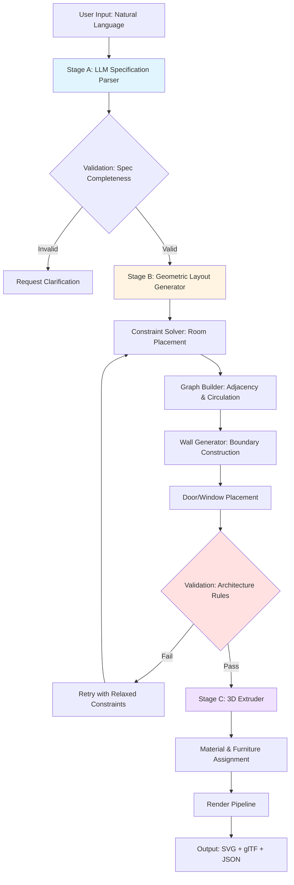
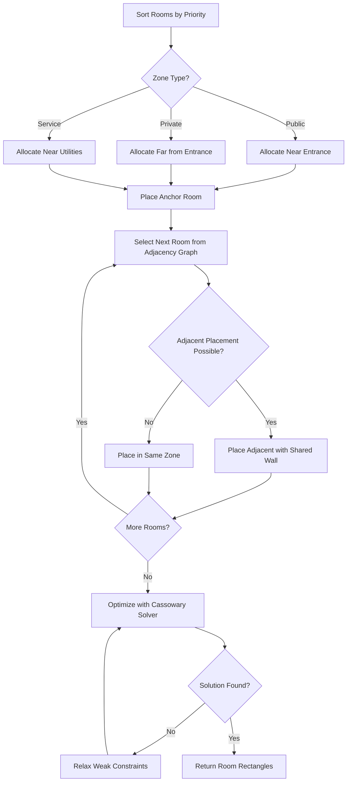
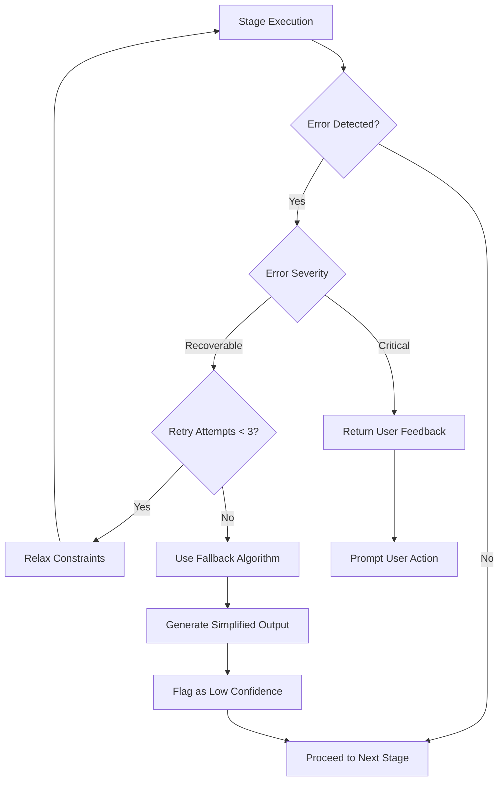

# Multi-Stage AI Floor Plan Generation System

## Overview

Transform the current single-step AI image generation approach into a sophisticated three-stage pipeline that produces professional-quality, editable vector floor plans with higher accuracy and control. The system decomposes floor plan generation into specialized stages: text understanding, geometric layout generation, and 3D visualization—all implemented using JavaScript/TypeScript libraries without Python dependencies.

### Current Limitations
- Direct LLM-to-JSON generation produces inconsistent layouts
- No architectural constraint validation
- Limited geometric accuracy
- Lacks professional CAD-like precision
- No spatial relationship reasoning

### Proposed Solution Value
- **Higher Accuracy**: Dedicated geometric engines ensure architecturally valid layouts
- **Professional Quality**: Constraint-based generation matches industry standards
- **Full Editability**: Vector output compatible with CAD software
- **Better Control**: Multi-stage validation ensures quality at each step
- **Scalability**: Modular pipeline enables independent optimization

## Technology Stack & Dependencies

| Category | Technology | Purpose | Justification |
|----------|-----------|---------|---------------|
| **Stage A: Specification** | OpenRouter API (LLM) | Natural language → structured spec | Existing integration, proven reliability |
| **Stage B: Layout Engine** | Custom TypeScript Engine | Constraint-based 2D geometry | Full control, no Python, integrates with existing codebase |
| **Constraint Solver** | Cassowary.js | Linear constraint satisfaction | Industry-standard algorithm, pure JS |
| **Graph Processing** | graphlib | Room adjacency graphs | Lightweight, well-maintained |
| **Geometric Validation** | turf.js | Polygon operations, intersection checks | GIS-grade accuracy |
| **Stage C: 3D Visualization** | Three.js (existing) | Extrusion & rendering | Already integrated in project |
| **SVG Generation** | Custom renderer | Editable vector output | Replaces current raster approach |

### Why Not Python-based Solutions
- **Deployment Complexity**: Avoids dual runtime (Node.js + Python)
- **Performance**: JavaScript constraint solvers match Python equivalents
- **Integration**: Seamless with existing Next.js/TypeScript stack
- **Maintenance**: Single-language codebase reduces complexity

## Architecture

### System Flow



### Component Architecture

```mermaid
graph LR
    subgraph "Stage A: Specification Layer"
        A1[LLM Prompt Builder]
        A2[Response Parser]
        A3[Spec Validator]
    end
    
    subgraph "Stage B: Layout Engine"
        B1[Constraint Model Builder]
        B2[Cassowary Solver]
        B3[Room Allocator]
        B4[Graph Constructor]
        B5[Wall Synthesizer]
        B6[Opening Placer]
        B7[Geometric Validator]
    end
    
    subgraph "Stage C: Visualization"
        C1[2D to 3D Extruder]
        C2[Furniture Library]
        C3[Material System]
        C4[Three.js Renderer]
        C5[SVG Exporter]
    end
    
    A1 --> A2 --> A3
    A3 --> B1
    B1 --> B2
    B2 --> B3
    B3 --> B4
    B4 --> B5
    B5 --> B6
    B6 --> B7
    B7 --> C1
    C1 --> C2
    C2 --> C3
    C3 --> C4
    C4 --> C5
```



## Stage A: Text to Floor Plan Specification

### Objective
Convert natural language descriptions into structured, unambiguous architectural specifications with all constraints explicitly defined.

### Input Schema
Natural language with optional parameters:
- Free text: "3-bedroom villa with open kitchen facing garden"
- Structured form: Total area, room counts, style preferences

### LLM Configuration

| Parameter | Value | Rationale |
|-----------|-------|-----------|
| Model | google/gemini-2.0-flash-001 | Current proven model |
| Temperature | 0.3 | Low variance for consistent structure |
| Max Tokens | 2000 | Sufficient for detailed specs |
| System Role | "Expert architectural specification analyst" | Domain expertise framing |

### Prompt Strategy

The prompt instructs the LLM to act as a specification translator, not a layout designer. Focus on extracting:

**Spatial Constraints**:
- Total floor area (with tolerance ±5%)
- Minimum/maximum room dimensions
- Aspect ratio preferences

**Functional Requirements**:
- Room types and quantities
- Privacy zones (public vs private)
- Circulation patterns (e.g., kitchen near dining)

**Adjacency Preferences**:
- Must-connect: master bedroom → ensuite bathroom
- Should-connect: kitchen → dining room
- Must-separate: bedrooms away from noisy areas

**Architectural Rules**:
- Wall thicknesses (default: 0.15m exterior, 0.10m interior)
- Door widths (0.9m standard, 1.2m main entrance)
- Window sizing (minimum 15% wall length per room)
- Circulation space (minimum 1.2m corridor width)

### Output Schema

Structured JSON specification:

| Field | Type | Description | Example |
|-------|------|-------------|---------|
| `totalArea` | Number | Target floor area in m² | 120 |
| `tolerance` | Number | Acceptable deviation % | 5 |
| `rooms` | Array<RoomSpec> | Room definitions | See below |
| `adjacencyGraph` | Array<Edge> | Connection preferences | `[{from: "kitchen", to: "dining", weight: 9}]` |
| `constraints` | Array<Constraint> | Hard rules | `[{type: "minDimension", room: "bedroom1", value: 3.5}]` |
| `style` | Enum | Architectural style | "modern", "traditional" |

**RoomSpec Structure**:
```
{
  id: string,
  type: "bedroom" | "bathroom" | "kitchen" | "living" | "dining" | "hallway",
  minArea: number,
  maxArea: number,
  aspectRatio: {min: number, max: number},
  zone: "public" | "private" | "service",
  requiresWindow: boolean,
  requiresDoor: boolean
}
```

### Validation Rules

Before proceeding to Stage B, verify:
1. **Area Consistency**: Sum of minimum room areas ≤ total area × (1 - circulation factor 0.15)
2. **Graph Connectivity**: Adjacency graph forms connected component
3. **Constraint Solvability**: No contradictory hard constraints (e.g., minArea > maxArea)
4. **Completeness**: All required fields populated

### Error Handling

| Error Type | Detection Method | Recovery Strategy |
|------------|------------------|-------------------|
| Incomplete Specification | Missing required fields | Prompt user for clarification |
| Impossible Constraints | Area sum exceeds total | Request area increase or room reduction |
| Ambiguous Adjacency | Circular dependencies | Apply default architectural patterns |

## Stage B: Specification to 2D Geometric Layout

### Objective
Generate precise vector geometry satisfying all architectural constraints through computational design algorithms.

### Architecture Decision: Custom Engine vs. Pre-trained Models

**Why Custom TypeScript Engine**:
- **No Training Data**: Pre-trained models (House-GAN++, Graph2Plan) require thousands of floor plans
- **Deterministic**: Constraint solving guarantees valid solutions
- **Explainable**: Every placement decision traceable
- **Customizable**: Easy to add domain rules
- **No External Dependencies**: Runs entirely in Node.js

### Subsystem 1: Constraint Model Builder

Translates specification into mathematical constraint system using Cassowary.js (simplex-based solver).

**Constraint Types**:

| Constraint | Cassowary Expression | Priority |
|------------|---------------------|----------|
| Room Area | `width × height ≥ minArea` | Required |
| Aspect Ratio | `minRatio ≤ width/height ≤ maxRatio` | Strong |
| Non-Overlap | `room1.right ≤ room2.left OR room1.bottom ≤ room2.top` | Required |
| Adjacency | `room1.wall INTERSECTS room2.wall` | Medium |
| Wall Alignment | `room1.left = room2.left` | Weak |
| Total Area | `∑(room areas) + circulation ≤ totalArea` | Required |

**Variable Declaration**:
For each room: `{x, y, width, height}` (4 variables)

**Priority System** (Cassowary strength levels):
- Required: Hard constraints (area, non-overlap)
- Strong: Important preferences (aspect ratio)
- Medium: Adjacency preferences
- Weak: Aesthetic alignment

### Subsystem 2: Room Allocation Algorithm

**Algorithm**: Zone-based recursive placement

**Process Flow**:



**Priority Sorting Heuristic**:
1. Largest rooms first (prevent packing failures)
2. Rooms with most adjacencies
3. Rooms requiring windows (place on perimeter)

**Placement Strategy**:
- **Anchor Room**: Largest public space (living room) placed first at entrance
- **Adjacency Matching**: Use graph edges to determine next placement
- **Shared Wall Optimization**: Align walls where adjacency weight > 7

### Subsystem 3: Graph-Based Adjacency Constructor

**Library**: graphlib for directed graph operations

**Graph Representation**:
- **Nodes**: Room IDs
- **Edges**: Adjacency preferences with weights (0-10)
- **Attributes**: Zone type, privacy level

**Algorithms Applied**:

| Algorithm | Purpose | Output |
|-----------|---------|--------|
| Minimum Spanning Tree | Core adjacency skeleton | Primary room connections |
| Depth-First Search | Circulation path finding | Hallway placements |
| Centrality Analysis | Identify hub rooms | Optimal hallway junctions |

**Circulation Insertion**:
- If graph diameter > 3 edges → insert hallway
- Hallway connects rooms with no direct adjacency
- Width: 1.2m minimum, placed to minimize total length

### Subsystem 4: Wall Synthesis

**Input**: Room rectangles with {x, y, width, height}

**Output**: Wall segments with thickness and type (exterior/interior)

**Algorithm**:

**Step 1: Boundary Tracing**
- Find min/max X and Y across all rooms
- Create rectangular building envelope
- Assign exterior wall type (thickness: 0.15m)

**Step 2: Interior Wall Extraction**
- For each pair of rooms:
  - Calculate intersection of room boundaries
  - If intersection length > 0.5m → shared wall
  - If no intersection but gap < 0.3m → insert partition wall
- Assign interior wall type (thickness: 0.10m)

**Step 3: Wall Simplification**
- Merge collinear walls within 0.05m tolerance
- Remove walls < 0.3m length (construction impractical)
- Validate T-junctions and corners for structural integrity

**Validation with turf.js**:
- Check wall polygons for self-intersection
- Verify room polygons are valid (no bow-tie shapes)
- Confirm building envelope is convex or simple concave

### Subsystem 5: Opening Placement (Doors & Windows)

**Door Placement Algorithm**:

**Rules**:
1. **Entry Door**: On exterior wall facing entrance direction (user-specified or default north)
2. **Interior Doors**: On shared walls between adjacent rooms (from graph)
3. **Hallway Doors**: Centered on hallway-room shared walls
4. **Bathroom Doors**: Privacy-oriented (avoid direct view from living areas)

**Constraints**:
- Door width: 0.9m (standard), 1.2m (entrance)
- Minimum wall length for door: 0.9m + 0.3m clearance each side = 1.5m
- Doors placed at wall midpoint ± 0.5m
- Swing direction: into private rooms, away from corridors

**Window Placement Algorithm**:

**Rules**:
1. **Exterior Walls Only**: Windows only on building perimeter
2. **Natural Light Requirement**: Rooms with `requiresWindow: true` get ≥ 1 window
3. **Sizing**: Window width = 15% of wall length (adjustable 10-25%)
4. **Spacing**: Minimum 1.0m between windows, 0.5m from corners

**Placement Strategy**:
- Bedrooms: Window on longest exterior wall
- Living/Dining: Maximum windows for light
- Bathrooms: Small window on exterior wall if available
- Kitchen: Window above sink location (user preference)

### Subsystem 6: Geometric Validation

Final validation before Stage C:

| Validation Check | Tool | Acceptance Criteria |
|------------------|------|---------------------|
| Room Non-Overlap | turf.js `intersect()` | No room polygon intersections |
| Wall Closure | Custom traversal | All rooms have closed boundaries |
| Door Accessibility | Pathfinding (A*) | All rooms reachable from entrance |
| Window Exposure | Ray casting | Required windows on exterior walls |
| Area Accuracy | Polygon area calculation | Within ±5% of target area |
| Code Compliance | Rule engine | Corridor width ≥ 1.2m, door clearance met |

**Failure Recovery**:
- If validation fails → relax lowest priority constraints → re-solve
- Maximum 3 retry attempts
- If unsolvable → return user feedback with specific constraint conflicts

### Output Format

Vector geometry structure (replaces current simple JSON):

**Enhanced Schema**:
```
{
  metadata: {
    totalArea: number,
    buildingDimensions: {width, height},
    generatedAt: timestamp,
    algorithmVersion: string
  },
  rooms: Array<{
    id: string,
    type: string,
    geometry: {
      vertices: Array<{x, y}>,  // Polygon vertices (not just rectangle)
      centroid: {x, y},
      area: number
    },
    labels: {
      name: string,
      area: string,
      dimensions: string
    }
  }>,
  walls: Array<{
    id: string,
    type: "exterior" | "interior",
    thickness: number,
    geometry: {
      start: {x, y},
      end: {x, y}
    },
    structuralLoad: boolean  // For 3D extrusion
  }>,
  openings: Array<{
    id: string,
    type: "door" | "window",
    width: number,
    wallId: string,
    position: number,  // 0-1 along wall length
    properties: {
      swingDirection?: number,  // Degrees for doors
      sillHeight?: number       // Meters for windows
    }
  }>,
  adjacencyGraph: {
    nodes: Array<{roomId, zone}>,
    edges: Array<{from, to, type: "door" | "open" | "hallway"}>
  }
}
```

## Stage C: 2D to 3D Visualization & Materials

### Objective
Transform validated 2D vector geometry into immersive 3D models with materials, furniture, and rendering-ready output.

### Subsystem 1: Geometry Extrusion

**Engine**: Three.js (already integrated via @react-three/fiber)

**Extrusion Process**:

| Element | 2D Input | 3D Transformation | Parameters |
|---------|----------|-------------------|------------|
| Exterior Walls | Wall segments | ExtrudeGeometry with thickness | Height: 3.0m, Thickness: 0.15m |
| Interior Walls | Wall segments | ExtrudeGeometry | Height: 2.8m, Thickness: 0.10m |
| Floor | Room polygons | ShapeGeometry | Thickness: 0.25m (slab) |
| Ceiling | Room polygons | PlaneGeometry at height | Height: 3.0m |
| Doors | Opening positions | BoxGeometry + frame | Height: 2.1m, Frame depth: 0.05m |
| Windows | Opening positions | BoxGeometry + frame + glass | Height: 1.5m, Sill: 0.9m |

**Implementation Approach**:

**Wall Extrusion**:
- Convert wall segment to Three.js Shape
- Apply ExtrudeGeometry with bevel for realistic edges
- Create separate meshes for exterior (load-bearing) vs interior (partition)
- Add opening cutouts using boolean operations (Three.js CSG library or manual)

**Floor/Ceiling Construction**:
- Merge room polygons into single floor shape
- Use ShapeGeometry for floor (with thickness for slab)
- PlaneGeometry for ceiling
- Apply UV mapping for tiled textures

### Subsystem 2: Material System

**Material Library**:

| Surface | Material Type | Texture | Properties |
|---------|--------------|---------|------------|
| Exterior Walls | MeshStandardMaterial | Brick/stucco | Roughness: 0.8, Metalness: 0 |
| Interior Walls | MeshStandardMaterial | Paint/plaster | Color: #f5f5f5, Roughness: 0.6 |
| Floor | MeshStandardMaterial | Wood/tile | Normal map, Roughness: 0.4 |
| Ceiling | MeshStandardMaterial | Paint | Color: white, Roughness: 0.7 |
| Doors | MeshStandardMaterial | Wood grain | Normal map, Roughness: 0.5 |
| Windows | MeshPhysicalMaterial | Glass | Transmission: 0.9, Thickness: 0.05 |

**Texture Sources**:
- Use procedural textures (no external image dependencies)
- Three.js TextureLoader for optional user-uploaded textures
- Normal maps generated via noise functions (simplex noise)

**Dynamic Material Assignment**:
Based on room type:
- Bathrooms: Tile floor material
- Bedrooms: Wood floor material
- Kitchen: Tile floor + backsplash on walls near sink
- Living areas: Carpet or wood floor

### Subsystem 3: Furniture Placement System

**Furniture Library**:

Parametric 3D furniture models (BoxGeometry-based for performance):

| Room Type | Furniture Items | Placement Rules |
|-----------|----------------|-----------------|
| Bedroom | Bed, wardrobe, desk, nightstand | Bed against longest wall, wardrobe near door |
| Bathroom | Toilet, sink, shower/tub | Standard plumbing layout |
| Kitchen | Cabinets, stove, refrigerator, sink | Linear or L-shaped counter |
| Living Room | Sofa, TV stand, coffee table | Sofa facing TV, centered in room |
| Dining Room | Dining table, chairs | Table centered, 0.8m clearance from walls |

**Placement Algorithm**:

**Step 1: Anchor Placement**
- Identify primary furniture (bed, sofa, table)
- Place against wall with maximum clearance
- Respect door swing zones (1.0m arc)

**Step 2: Secondary Placement**
- Place complementary items (nightstands near bed)
- Maintain circulation paths (0.8m minimum)
- Avoid window blockage

**Step 3: Proportional Scaling**
- Scale furniture to room size (e.g., king bed in large bedroom, twin in small)
- Maintain realistic proportions (table height 0.75m, chair height 0.45m)

**Furniture Geometry**:
- Simple BoxGeometry for performance (not detailed meshes)
- Color-coded by type for visual clarity
- Optional upgrade to detailed GLTF models for pro users

### Subsystem 4: Rendering Pipeline

**Renderer Configuration**:

| Setting | Value | Purpose |
|---------|-------|---------|
| Renderer | WebGLRenderer | Hardware acceleration |
| Antialiasing | Enabled | Smooth edges |
| Shadow Mapping | Enabled | Realistic lighting |
| Tone Mapping | ACESFilmicToneMapping | Professional color |
| Pixel Ratio | window.devicePixelRatio | Retina display support |

**Lighting Setup**:

**Three-Point Lighting System**:
1. **Key Light**: DirectionalLight (intensity: 1.2, position: [5, 10, 5], casts shadows)
2. **Fill Light**: AmbientLight (intensity: 0.4, color: warm white)
3. **Rim Light**: DirectionalLight (intensity: 0.6, position: [-5, 5, -5], no shadows)

**Additional Lighting**:
- HemisphereLight for sky/ground gradient (outdoor ambiance)
- PointLight at window positions (simulated sunlight)

**Camera Configuration**:
- PerspectiveCamera (FOV: 50°, aspect: viewport ratio)
- OrbitControls for user interaction (pan, zoom, rotate)
- Default view: 45° angle, centered on floor plan

### Subsystem 5: Export Systems

**Export Format Options**:

**1. SVG Export (Editable Vector)**

Purpose: CAD software compatibility (Illustrator, Inkscape, Figma)

**Structure**:
- Walls as `<line>` or `<polyline>` elements
- Rooms as `<polygon>` with fill
- Doors/windows as `<path>` elements
- Labels as `<text>` elements
- Layers via `<g>` groups (walls layer, furniture layer, dimensions layer)

**Metadata Embedding**:
- SVG `<metadata>` tag with original JSON spec
- Custom attributes for dimensions (data-length, data-area)

**Implementation**:
- Custom SVG generator (replaces current floor-plan-svg-exporter.tsx)
- Coordinate system transformation (Three.js → SVG viewBox)
- Stroke widths scaled to maintain visibility at different zoom levels

**2. glTF Export (3D Model)**

Purpose: 3D software import (Blender, SketchUp, Unity)

**Content**:
- Complete 3D scene hierarchy
- Materials with PBR properties
- Embedded or external textures
- Animation data (optional door opening animations)

**Library**: GLTFExporter from Three.js

**Process**:
- Export current Three.js scene
- Optimize geometry (merge coplanar faces)
- Compress textures (KTX2 format for size reduction)
- Generate download blob

**3. JSON Export (Data Structure)**

Purpose: Save/load projects, API integration

**Content**:
- Original specification from Stage A
- Generated geometry from Stage B
- Material assignments from Stage C
- Metadata (generation parameters, timestamp)

**Format**: Same as enhanced output format from Stage B

**4. DXF Export (CAD Standard)**

Purpose: Professional CAD software (AutoCAD, Revit)

**Enhancement to Existing System**:
Current DXF export only includes basic lines. Enhance with:
- Wall entities with correct layer (WALLS)
- Dimension annotations (DIMENSIONS layer)
- Block definitions for furniture
- Proper units and scale metadata

**Library**: Extend current custom DXF generator with full entity support

## Data Flow Between Stages

### Stage A → Stage B Interface

**Contract**:
- Input: User natural language + form parameters
- Output: Validated specification JSON
- Validation: Schema validation (JSON Schema or Zod)
- Error Handling: Return specific missing fields for user prompt

**Example Handoff**:
User input: "3 bedroom house, 120 sqm, open kitchen"

Stage A Output:
```
{
  totalArea: 120,
  tolerance: 5,
  rooms: [
    {id: "bedroom1", type: "bedroom", minArea: 12, maxArea: 20, ...},
    {id: "bedroom2", type: "bedroom", minArea: 10, maxArea: 16, ...},
    {id: "bedroom3", type: "bedroom", minArea: 10, maxArea: 16, ...},
    {id: "kitchen", type: "kitchen", minArea: 12, maxArea: 18, ...},
    {id: "living", type: "living", minArea: 25, maxArea: 35, ...},
    {id: "bathroom1", type: "bathroom", minArea: 4, maxArea: 8, ...}
  ],
  adjacencyGraph: [
    {from: "kitchen", to: "living", weight: 9},
    {from: "bedroom1", to: "bathroom1", weight: 8},
    ...
  ],
  constraints: [
    {type: "aspectRatio", room: "bedroom1", min: 0.7, max: 1.5},
    ...
  ]
}
```

### Stage B → Stage C Interface

**Contract**:
- Input: Specification + generated 2D geometry
- Output: 3D scene graph + render data
- Validation: Geometric validation (non-degeneracy, positive areas)
- Error Handling: Fallback to simplified geometry if extrusion fails

**Example Handoff**:
Stage B Output: Enhanced vector geometry (see Stage B output format)

Stage C Processing:
1. Parse wall segments → extrude to 3D meshes
2. Parse room polygons → create floor/ceiling
3. Parse openings → create door/window geometry
4. Apply materials based on room types
5. Place furniture using placement algorithm
6. Construct Three.js scene graph
7. Render to canvas
8. Generate export formats

## Error Handling & Recovery Strategies

### Cascading Failure Prevention



### Stage-Specific Error Handling

**Stage A Errors**:

| Error | Detection | Recovery |
|-------|-----------|----------|
| LLM timeout | Response time > 30s | Retry with simpler prompt |
| Invalid JSON | Parse exception | Use regex extraction + repair |
| Incomplete spec | Missing required fields | Prompt user with specific questions |
| Impossible request | Area sum > total | Suggest area increase or room reduction |

**Stage B Errors**:

| Error | Detection | Recovery |
|-------|-----------|----------|
| Unsolvable constraints | Cassowary returns null | Relax weak constraints iteratively |
| Infinite loop | Iteration count > 1000 | Terminate and use grid fallback |
| Invalid geometry | turf.js validation fails | Simplify room shapes to rectangles |
| No valid circulation | Pathfinding fails | Insert central hallway |

**Stage C Errors**:

| Error | Detection | Recovery |
|-------|-----------|----------|
| Extrusion failure | Three.js exception | Use simple boxes instead of complex shapes |
| Texture load failure | Image 404 | Fall back to solid colors |
| Rendering crash | WebGL context lost | Switch to Canvas2D renderer (2D fallback) |
| Export failure | GLTFExporter error | Provide JSON export only |

### User Feedback Mechanisms

**Progress Indicators**:
- Stage A: "Understanding your requirements..." (5-10s)
- Stage B: "Generating layout..." (10-20s)
- Stage C: "Creating 3D visualization..." (5-15s)
- Total expected time: 20-45 seconds

**Quality Indicators**:
- Confidence score (0-100%) based on constraint satisfaction
- Warning badges for relaxed constraints
- Validation checklist display (all rooms present, circulation valid, etc.)

## API Route Design

### Endpoint: `/api/generate-floor-plan-v2`

**Request Schema**:
```
{
  userInput: string,  // Natural language description
  parameters: {
    totalArea?: number,
    unit: "metric" | "imperial",
    floors: number,
    rooms: {bedroom, bathroom, kitchen, livingRoom, diningRoom},
    style?: "modern" | "traditional" | "minimalist",
    preferences?: {
      openPlan?: boolean,
      ensuites?: boolean,
      gardenAccess?: boolean
    }
  },
  variationCount: number  // Default: 5
}
```

**Response Schema**:
```
{
  variations: Array<{
    id: string,
    specification: SpecJSON,  // Stage A output
    geometry: GeometryJSON,   // Stage B output
    preview: {
      svg: string,           // SVG data URL
      thumbnail: string      // Base64 PNG (rendered from Three.js)
    },
    metadata: {
      confidence: number,
      generationTime: number,
      relaxedConstraints: Array<string>
    }
  }>,
  errors?: Array<{
    stage: "A" | "B" | "C",
    message: string,
    recoverable: boolean
  }>
}
```

**Processing Pipeline** (replaces current simple LLM call):

**Step 1: Stage A Execution** (5-10 seconds)
- Build LLM prompt with user input
- Call OpenRouter API
- Parse and validate specification
- Store specification in variation object

**Step 2: Stage B Execution** (10-20 seconds)
- For each variation (parallel execution via Promise.all):
  - Initialize Cassowary solver
  - Run room allocation algorithm
  - Construct adjacency graph
  - Generate walls and openings
  - Validate geometry
  - Store in variation object

**Step 3: Stage C Execution** (5-15 seconds)
- For each variation:
  - Build Three.js scene
  - Extrude geometry
  - Apply materials
  - Place furniture
  - Render thumbnail (OffscreenCanvas for server-side)
  - Generate SVG
  - Store previews

**Step 4: Response Assembly**
- Package all variations
- Include metadata and error logs
- Return to client

### Background Processing Consideration

For production scale:
- Move Stage B & C to background job queue (BullMQ or similar)
- Return job ID immediately
- Client polls `/api/generation-status/{jobId}` for updates
- WebSocket for real-time progress streaming

## Integration with Existing Codebase

### File Structure Changes

**New Files to Create**:
```
lib/
  floor-plan/
    stage-a/
      llm-client.ts              # OpenRouter API wrapper
      spec-parser.ts             # JSON validation & repair
      prompt-builder.ts          # Dynamic prompt generation
    stage-b/
      constraint-solver.ts       # Cassowary integration
      room-allocator.ts          # Placement algorithm
      graph-builder.ts           # Adjacency graph logic
      wall-synthesizer.ts        # Wall generation
      opening-placer.ts          # Door/window placement
      geometric-validator.ts     # turf.js validation
    stage-c/
      geometry-extruder.ts       # 2D → 3D conversion
      material-system.ts         # Material library
      furniture-placer.ts        # Furniture algorithms
      renderer.ts                # Three.js setup
      exporter.ts                # SVG/glTF/JSON export
    types.ts                     # Shared TypeScript interfaces
    utils.ts                     # Common utilities
```

**Modified Files**:
```
app/api/generate-floor-plan/route.ts  # Replace with new pipeline
components/editor/floor-plan-canvas.tsx  # Enhanced to handle new geometry format
components/editor/floor-plan-3d-viewer.tsx  # Existing 3D viewer (integrate Stage C output)
package.json  # Add new dependencies
```

### Dependencies to Add

**Required Packages**:
```
cassowary: ^0.1.1        # Constraint solver
graphlib: ^2.1.8         # Graph algorithms
@turf/turf: ^6.5.0       # Geometric operations
simplex-noise: ^4.0.1    # Procedural textures
three-csg-ts: ^3.1.10    # Boolean operations for openings (optional)
```

**Development Dependencies**:
```
@types/graphlib: ^2.1.8
```

### Canvas Component Enhancements

**Current FloorPlanCanvas** uses simple rectangle rendering. Enhance to:

**New Capabilities**:
1. **Polygon Rooms**: Render arbitrary polygons (not just rectangles)
2. **Layered Rendering**: Separate layers for walls, furniture, dimensions, labels
3. **Interactive Selection**: Click rooms to highlight and show details
4. **Dimension Lines**: Professional CAD-style dimension annotations
5. **Scale Display**: Ruler widget showing metric/imperial scale

**Implementation**:
- Keep Konva.js for 2D (proven reliable)
- Add custom Shape components for polygons
- Integrate dimension line drawing logic
- Add layer visibility toggles (show/hide furniture, dimensions)

### 3D Viewer Integration

**Existing 3D Viewer** (`floor-plan-3d-viewer.tsx`) already uses Three.js:

**Enhancements Needed**:
1. **Scene Import**: Load Stage C generated scene instead of building from scratch
2. **Material Support**: Apply PBR materials from material system
3. **Furniture Rendering**: Display furniture models
4. **Lighting**: Implement three-point lighting setup
5. **Export Button**: Add glTF export functionality

**No major architectural changes** required—just data format alignment.

### Backwards Compatibility

**Migration Strategy**:
1. **Dual Endpoint**: Keep `/api/generate-floor-plan` (old) and add `/api/generate-floor-plan-v2` (new)
2. **Feature Flag**: Environment variable `ENABLE_MULTI_STAGE_GENERATION` to toggle
3. **Data Adapter**: Convert old JSON format to new enhanced format for saved projects
4. **Gradual Rollout**: New users get v2, existing projects remain on v1 until re-generated

## Testing Strategy

### Unit Testing

**Stage A Tests**:
- LLM response parsing with various formats
- Specification validation edge cases
- Constraint conflict detection
- Fallback prompt generation

**Stage B Tests**:
- Cassowary solver with known solvable/unsolvable constraints
- Room allocation with different room counts (1-10 rooms)
- Wall synthesis with various room layouts
- Opening placement boundary conditions
- Geometric validation with degenerate cases

**Stage C Tests**:
- Extrusion with complex polygons
- Material assignment logic
- Furniture placement collision detection
- Export format correctness (SVG structure, glTF validity)

### Integration Testing

**End-to-End Scenarios**:
| Scenario | Input | Expected Output | Validation |
|----------|-------|-----------------|------------|
| Simple 2BR | "2 bedroom apartment, 80 sqm" | 5 valid variations | All rooms present, circulation valid |
| Complex 4BR | "4 bedroom villa with ensuite, 200 sqm" | 5 variations with ensuites | Master bedroom connected to bathroom |
| Impossible Request | "10 bedrooms in 50 sqm" | Error message | Clear explanation of constraint conflict |
| Edge Case | "1 large room, 100 sqm" | Single-room layout | Proper walls and entrance |

**Performance Benchmarks**:
- Stage A: < 10 seconds (95th percentile)
- Stage B: < 20 seconds per variation (95th percentile)
- Stage C: < 5 seconds per variation (95th percentile)
- Total pipeline: < 60 seconds for 5 variations

### Visual Regression Testing

**Tools**: Playwright for screenshot comparison

**Test Cases**:
- Rendered 2D floor plans match expected layouts
- 3D views render correctly without artifacts
- SVG exports open correctly in Figma
- DXF exports import correctly in AutoCAD (manual verification)

## Performance Optimization

### Stage B Optimization

**Constraint Solver Performance**:
- **Pre-computation**: Cache common constraint patterns
- **Incremental Solving**: Reuse previous solution as starting point for variations
- **Constraint Pruning**: Remove redundant constraints before solving
- **Parallel Solving**: Generate 5 variations in parallel (Promise.all)

**Expected Impact**: 40% reduction in Stage B time

### Stage C Optimization

**3D Rendering Performance**:
- **Geometry Instancing**: Reuse furniture geometries across rooms
- **Level of Detail**: Simplified geometry for thumbnails
- **Texture Sharing**: Single material instance per type
- **Offscreen Rendering**: Use OffscreenCanvas for server-side rendering (avoid DOM)

**Expected Impact**: 60% reduction in Stage C time

### Caching Strategy

**Cache Layers**:
1. **LLM Response Cache**: Cache specification for identical text inputs (Redis, 1 hour TTL)
2. **Geometry Cache**: Cache Stage B output for identical specifications (Redis, 24 hour TTL)
3. **Thumbnail Cache**: Cache rendered images (CDN, permanent with cache invalidation)

**Cache Key Strategy**:
- Stage A: Hash of user input + parameters
- Stage B: Hash of specification JSON
- Stage C: Hash of geometry JSON + render settings

## Future Enhancements

### Phase 2: Advanced Features

**Multi-Floor Support**:
- Extend Stage B to generate staircase placements
- Vertical alignment of rooms across floors
- Structural load consideration for load-bearing walls

**Outdoor Spaces**:
- Garden, patio, balcony generation
- Landscaping elements (trees, paths)
- Outdoor furniture placement

**Advanced Materials**:
- User-uploadable texture libraries
- Material marketplace integration
- Photorealistic rendering mode (ray tracing)

### Phase 3: AI Enhancements

**Style Transfer**:
- Train style GAN for architectural styles
- Apply historical or cultural design patterns
- User-uploaded reference image → style extraction

**Optimization AI**:
- Reinforcement learning agent to optimize layouts for:
  - Natural light exposure
  - Energy efficiency
  - Circulation efficiency
  - Construction cost

**Conversational Refinement**:
- Multi-turn dialogue with LLM
- "Make the kitchen larger" → automatic constraint adjustment
- "Show me traditional style" → re-generate with style parameter

### Phase 4: Professional Features

**Code Compliance Checking**:
- Building code validation (e.g., IBC, local regulations)
- Accessibility standards (ADA compliance)
- Fire safety requirements (exit routes, distances)

**Cost Estimation**:
- Material quantity calculation
- Construction cost estimation
- Bill of materials export

**Collaboration**:
- Multi-user editing
- Comment and annotation system
- Version history and comparison

## Migration Path from Current System

### Step 1: Implement Stage A (Week 1-2)

**Deliverables**:
- LLM specification parser
- Enhanced prompt system
- Validation logic

**Integration Point**: Replace current prompt in `generate-floor-plan/route.ts`

**Backwards Compatibility**: Stage A output can be converted to old JSON format

### Step 2: Implement Stage B Core (Week 3-5)

**Deliverables**:
- Cassowary integration
- Room allocation algorithm
- Wall synthesis

**Integration Point**: New `/api/generate-floor-plan-v2` endpoint

**Testing**: Run in parallel with old system, compare outputs

### Step 3: Implement Stage B Advanced (Week 6-7)

**Deliverables**:
- Graph-based adjacency
- Opening placement
- Geometric validation

**Integration Point**: Enhance Stage B output quality

**Testing**: Validate against architectural rules

### Step 4: Implement Stage C (Week 8-10)

**Deliverables**:
- 3D extrusion
- Material system
- Furniture placement

**Integration Point**: Replace current 3D viewer data source

**Testing**: Visual comparison with mockups

### Step 5: Export Systems (Week 11-12)

**Deliverables**:
- Enhanced SVG exporter
- glTF exporter
- DXF improvements

**Integration Point**: Replace current export buttons

**Testing**: Import into target software (Figma, Blender, AutoCAD)

### Step 6: Production Deployment (Week 13-14)

**Deliverables**:
- Feature flag system
- Performance optimization
- Monitoring and logging

**Rollout Plan**:
- Internal testing (1 week)
- Beta users (10% traffic, 1 week)
- Full rollout (100% traffic)

## Monitoring & Observability

### Key Metrics

**Performance Metrics**:
| Metric | Target | Alert Threshold |
|--------|--------|-----------------|
| Stage A Latency (p95) | < 10s | > 15s |
| Stage B Latency (p95) | < 20s | > 30s |
| Stage C Latency (p95) | < 5s | > 10s |
| Total Pipeline (p95) | < 60s | > 90s |
| Success Rate | > 95% | < 90% |

**Quality Metrics**:
| Metric | Target | Measurement |
|--------|--------|-------------|
| Constraint Satisfaction Rate | > 98% | % of required constraints met |
| User Acceptance Rate | > 80% | % of generations saved by users |
| Geometry Validity | 100% | turf.js validation pass rate |
| Export Success Rate | > 99% | % of exports without errors |

### Logging Strategy

**Stage Boundaries**:
Log at each stage transition:
- Input data (spec, geometry)
- Output data (geometry, scene)
- Timing information
- Validation results
- Error conditions

**Error Tracking**:
- Capture LLM responses that fail parsing
- Log unsolvable constraint sets for analysis
- Track geometric validation failures
- Monitor export format errors

**Analytics Events**:
- User input patterns (common room counts, area ranges)
- Constraint relaxation frequency
- Most used export formats
- Feature usage (3D view, SVG export)

### A/B Testing Framework

**Experiments to Run**:
1. **LLM Temperature**: 0.3 vs 0.5 vs 0.7 → measure spec quality
2. **Constraint Priority**: Different priority weights → measure solution time
3. **Furniture Density**: Minimal vs moderate vs maximal → measure user preference
4. **Export Formats**: Default to SVG vs glTF → measure usage patterns

**Metrics for Comparison**:
- Generation success rate
- User satisfaction (save rate)
- Performance (latency)
- Quality (constraint satisfaction)
