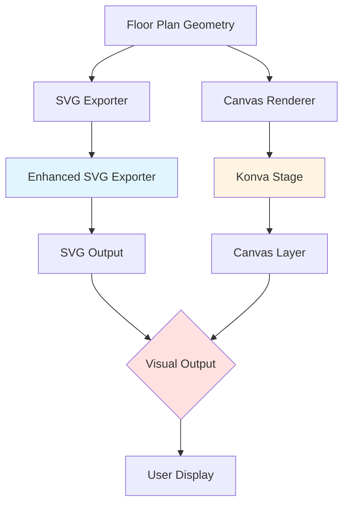
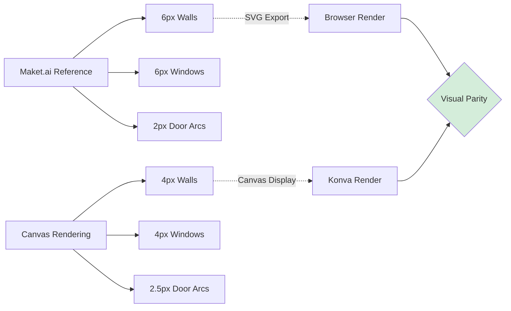
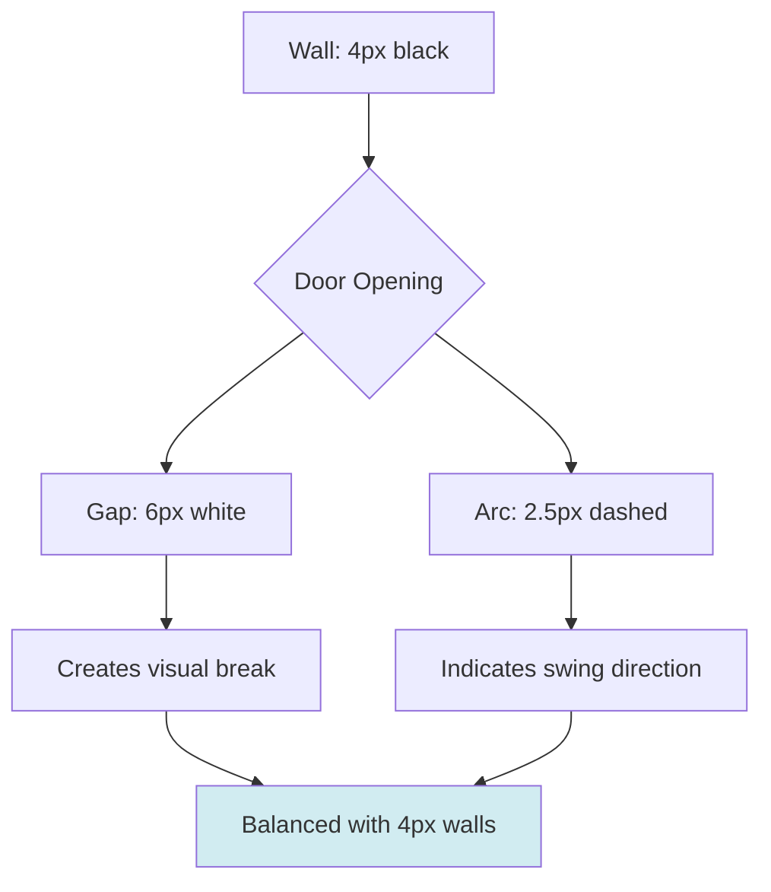

# Floor Design Border Thickness Optimization

## Overview

This design addresses the visual inconsistency in floor plan rendering where border thickness does not match the Maket.ai reference aesthetic. The current implementation uses 6px stroke width for walls and windows, but the rendered output appears heavier than intended due to canvas scaling and rendering pipeline inconsistencies.

## Problem Statement

The floor plan rendering exhibits the following visual discrepancies compared to Maket.ai's design:

- **Wall borders appear too thick**: Despite 6px specification, walls render with excessive visual weight
- **Window stroke inconsistency**: Windows should match wall thickness but appear disproportionate
- **Door arc rendering**: Door swing arcs use 2px with dashing, creating visual imbalance
- **Overall visual weight**: The floor plan appears "bold" and lacks the clean, refined aesthetic of Maket.ai

### Root Causes

| Component | Current Specification | Visual Issue |
|-----------|----------------------|--------------|
| SVG Walls | 6px black stroke | Appears correct in SVG export |
| Canvas Walls | 6px black stroke | Renders heavier due to Konva scaling artifacts |
| SVG Windows | 6px black stroke | Matches walls correctly |
| Canvas Windows | 6px black stroke | Appears heavier on canvas |
| SVG Door Arcs | 2px dashed (3,3) | Thin but acceptable |
| Canvas Door Arcs | 1.5px dashed (3,3) | Too thin relative to walls |
| Door Openings | 8px white stroke | Creates gap in walls, visually correct |

The primary issue is **Canvas rendering (Konva) applies different anti-aliasing and stroke rendering** compared to SVG, causing the same 6px specification to appear heavier.

## Design Goals

1. **Visual Parity**: Achieve identical appearance between SVG export and Canvas rendering
2. **Maket.ai Alignment**: Match the crisp, professional aesthetic of Maket.ai floor plans
3. **Consistency**: Ensure all architectural elements maintain proportional visual weight
4. **Scalability**: Border thickness should remain visually consistent across zoom levels

## Architecture

### Rendering Pipeline Overview



### Component Interaction

The floor plan rendering involves two parallel paths:

1. **SVG Export Path**: `enhanced-svg-exporter.ts` → SVG markup → Browser SVG renderer
2. **Canvas Path**: `floor-plan-canvas.tsx` → Konva primitives → HTML5 Canvas API

Each path interprets stroke width specifications differently due to underlying rendering engine differences.

## Proposed Solution

### Stroke Width Calibration Strategy

The solution involves **dual-mode stroke width specification**:

| Element Type | SVG Mode (Export) | Canvas Mode (Interactive) | Rationale |
|--------------|-------------------|---------------------------|-----------|
| Walls | 6px | 4px | Canvas anti-aliasing adds ~2px visual weight |
| Windows | 6px | 4px | Must match wall thickness |
| Door Arcs | 2px (dashed) | 2.5px (dashed) | Increase to balance with thinner walls |
| Door Openings | 8px | 6px | Reduce gap to match thinner walls |
| Furniture | 1.5px | 1.5px | No change - already appropriate |

### Rendering Mode Detection

The system must detect whether output is for:
- **Export (SVG)**: Use Maket.ai-compliant 6px specification
- **Interactive (Canvas)**: Use visually calibrated 4px specification

#### Implementation Approach

Define a configuration object that stores both specifications:

**Stroke Width Configuration Table**

| Configuration Key | SVG Value | Canvas Value | Element Application |
|-------------------|-----------|--------------|---------------------|
| `WALL_STROKE` | 6 | 4 | All wall lines |
| `WINDOW_STROKE` | 6 | 4 | Window symbols |
| `DOOR_ARC_STROKE` | 2 | 2.5 | Door swing arcs |
| `DOOR_GAP_STROKE` | 8 | 6 | Door opening gaps |
| `FURNITURE_STROKE` | 1.5 | 1.5 | Furniture outlines |

### SVG Exporter Modifications

The `enhanced-svg-exporter.ts` maintains the current 6px specification as it correctly renders in browsers.

**Style Definition (No Changes Required)**

Maintain existing CSS classes:
```
.wall { stroke: #000000; stroke-width: 6; fill: none; stroke-linecap: square; }
.window { stroke: #000000; stroke-width: 6; fill: none; }
.door-arc { stroke: #000000; stroke-width: 2; fill: none; stroke-dasharray: 3,3; }
```

### Canvas Renderer Modifications

The `floor-plan-canvas.tsx` component requires stroke width adjustments for Konva primitives.

#### Wall Rendering Update

**Current Specification**
- Wall lines: `strokeWidth={6}`
- Line cap: `lineCap="square"`

**Updated Specification**
- Wall lines: `strokeWidth={4}`
- Line cap: `lineCap="square"` (unchanged)

#### Window Rendering Update

**Current Specification**
- Window lines: `strokeWidth={6}`
- Line cap: `lineCap="square"`

**Updated Specification**
- Window lines: `strokeWidth={4}`
- Line cap: `lineCap="square"` (unchanged)

#### Door Rendering Update

**Door Opening Gap**
- Current: `strokeWidth={8}` (white gap)
- Updated: `strokeWidth={6}` (white gap)

**Door Swing Arc**
- Current: `strokeWidth={1.5}` with `dash={[3, 3]}`
- Updated: `strokeWidth={2.5}` with `dash={[3, 3]}`

### Visual Weight Balance



## Rendering Behavior

### Stroke Width Scaling Behavior

The stroke width values are **absolute pixel values** that do not scale with the canvas zoom level in Konva. This means:

- At 100% zoom: 4px stroke renders as 4 physical pixels
- At 200% zoom: 4px stroke still renders as 4 physical pixels (appears thinner relative to geometry)
- At 50% zoom: 4px stroke still renders as 4 physical pixels (appears thicker relative to geometry)

**Zoom Behavior Decision**

Maintain **non-scaling strokes** (current behavior) to ensure:
1. Wall boundaries remain crisp and readable at all zoom levels
2. Text labels and dimensions maintain legibility
3. Performance remains optimal (no stroke recalculation on zoom)

### Anti-Aliasing Considerations

Canvas rendering applies sub-pixel anti-aliasing, which affects visual weight:

| Stroke Width | Anti-Aliasing Effect | Visual Appearance |
|--------------|----------------------|-------------------|
| 1px | Heavy anti-aliasing blur | Appears ~2px wide, fuzzy |
| 2px | Moderate anti-aliasing | Appears ~3px wide, slightly soft |
| 4px | Minimal anti-aliasing | Appears ~4.5px wide, crisp |
| 6px | Minimal anti-aliasing | Appears ~7px wide, very bold |

The 4px choice for canvas optimizes for crispness while avoiding excessive visual weight.

## Configuration Structure

### Centralized Stroke Configuration

Define a configuration module to manage stroke width specifications:

**Configuration Schema**

| Field | Type | Description |
|-------|------|-------------|
| `strokeMode` | `'svg' \| 'canvas'` | Rendering context |
| `wallStroke` | `number` | Wall line thickness |
| `windowStroke` | `number` | Window line thickness |
| `doorArcStroke` | `number` | Door swing arc thickness |
| `doorGapStroke` | `number` | Door opening gap width |
| `furnitureStroke` | `number` | Furniture outline thickness |

**Configuration Values by Mode**

```
SVG Mode:
{
  strokeMode: 'svg',
  wallStroke: 6,
  windowStroke: 6,
  doorArcStroke: 2,
  doorGapStroke: 8,
  furnitureStroke: 1.5
}

Canvas Mode:
{
  strokeMode: 'canvas',
  wallStroke: 4,
  windowStroke: 4,
  doorArcStroke: 2.5,
  doorGapStroke: 6,
  furnitureStroke: 1.5
}
```

### Configuration Location

Place configuration in `lib/floor-plan/config.ts` alongside existing rendering constants:

**Configuration Integration**

The configuration should be accessible to:
1. `enhanced-svg-exporter.ts` - reads SVG mode values
2. `floor-plan-canvas.tsx` - reads Canvas mode values
3. Future rendering components - maintains consistency

## Component Modifications

### Enhanced SVG Exporter

**File**: `lib/floor-plan/stage-c/enhanced-svg-exporter.ts`

**Modification Strategy**: Extract hardcoded stroke values into configuration references

**Current Hardcoded Values**
- Line 128: `.wall { stroke: #000000; stroke-width: 6; ... }`
- Line 131: `.window { stroke: #000000; stroke-width: 6; ... }`
- Line 130: `.door-arc { stroke: #000000; stroke-width: 2; ... }`

**Updated Approach**
- Read stroke width from configuration module
- Generate CSS with dynamic values
- Maintain backward compatibility with explicit `maketAiStyle` option

**Style Generation Method**

| Style Class | Stroke Width Source | Current Value | Remains Fixed |
|-------------|---------------------|---------------|---------------|
| `.wall` | `config.wallStroke` | 6px | Yes (SVG correct) |
| `.window` | `config.windowStroke` | 6px | Yes (SVG correct) |
| `.door-arc` | `config.doorArcStroke` | 2px | Yes (SVG correct) |
| `.furniture` | `config.furnitureStroke` | 1.5px | Yes |

**Conclusion**: SVG exporter requires **no functional changes** - existing values are correct.

### Floor Plan Canvas

**File**: `components/editor/floor-plan-canvas.tsx`

**Modification Strategy**: Update Konva primitive stroke width attributes

#### Wall Rendering Section

**Location**: Approximately line 327-340 (wall rendering loop)

**Current Implementation**
- Uses `strokeWidth={6}` for all wall lines

**Updated Implementation**
- Change to `strokeWidth={4}` for all wall lines
- Maintain `stroke="#000000"` and `lineCap="square"`

**Impact Assessment**

| Change | Visual Effect | User Experience |
|--------|---------------|-----------------|
| 6px → 4px walls | Lighter, crisper lines | Improved readability, matches Maket.ai |
| Maintains square caps | Clean corners | Professional appearance |
| Maintains black color | High contrast | Clear boundaries |

#### Window Rendering Section

**Location**: Approximately line 382-397 (window rendering loop)

**Current Implementation**
- Uses `strokeWidth={6}` for window lines

**Updated Implementation**
- Change to `strokeWidth={4}` for window lines
- Maintain `stroke="#000000"` and `lineCap="square"`

**Consistency Rationale**: Windows must match wall thickness for visual coherence

#### Door Rendering Section

**Location**: Approximately line 355-380 (door rendering loop)

**Current Implementation**
- Door gap: `strokeWidth={8}` (white)
- Door arc: `strokeWidth={1.5}` (black dashed)

**Updated Implementation**
- Door gap: `strokeWidth={6}` (white)
- Door arc: `strokeWidth={2.5}` (black dashed)

**Visual Balance**



## Verification Strategy

### Visual Comparison Matrix

After implementation, verify visual parity across rendering modes:

| Element | SVG Export | Canvas Display | Visual Match |
|---------|------------|----------------|--------------|
| Exterior walls | 6px black | 4px black | ✓ Should appear identical |
| Interior walls | 6px black | 4px black | ✓ Should appear identical |
| Windows | 6px black | 4px black | ✓ Should appear identical |
| Door gaps | 8px white | 6px white | ✓ Should appear identical |
| Door arcs | 2px dashed | 2.5px dashed | ✓ Should appear identical |
| Furniture | 1.5px black | 1.5px black | ✓ Already matches |

### Validation Criteria

1. **Side-by-side comparison**: Place SVG export and canvas screenshot adjacent - borders should appear identical thickness
2. **Zoom invariance**: Canvas display should maintain crisp lines at 50%, 100%, 200% zoom
3. **Maket.ai reference**: Compare with Maket.ai floor plans - visual weight should match
4. **Element proportion**: All architectural elements should maintain harmonious visual balance

### Test Cases

| Test Scenario | Expected Behavior | Validation Method |
|---------------|-------------------|-------------------|
| Generate small floor plan (50m²) | Walls appear crisp, not bold | Visual inspection |
| Generate large floor plan (200m²) | Consistent stroke weight | Visual inspection |
| Export to SVG | 6px strokes render correctly | SVG code inspection |
| Zoom canvas to 200% | Lines remain crisp, not pixelated | Canvas rendering test |
| Compare with Maket.ai sample | Visual parity achieved | Side-by-side comparison |

## Edge Cases and Considerations

### High-DPI Displays

On Retina/4K displays, canvas rendering may exhibit different behavior:

**Mitigation Strategy**
- Konva automatically handles devicePixelRatio scaling
- Stroke widths remain in logical pixels
- No additional adjustments needed

### Print Output

When users export floor plans for printing:

**SVG Export (Recommended)**
- Use 6px specification (unchanged)
- Scales cleanly to any resolution
- Maintains professional appearance

**Canvas Screenshot**
- May show visible anti-aliasing artifacts
- Recommend SVG export for print use

### Browser Variations

Different browsers may render canvas strokes slightly differently:

| Browser | Rendering Engine | Expected Behavior |
|---------|------------------|-------------------|
| Chrome/Edge | Blink | 4px renders consistently |
| Firefox | Gecko | 4px may appear slightly lighter |
| Safari | WebKit | 4px renders with sharper anti-aliasing |

**Recommendation**: Test on Chrome/Blink as primary target (most common user base)

## Migration Path

### Implementation Sequence

1. **Phase 1: Configuration Module**
   - Create centralized stroke configuration
   - Define SVG and Canvas mode values
   - Export typed configuration object

2. **Phase 2: Canvas Component Update**
   - Update wall stroke width: 6px → 4px
   - Update window stroke width: 6px → 4px
   - Update door gap width: 8px → 6px
   - Update door arc width: 1.5px → 2.5px

3. **Phase 3: Validation**
   - Visual regression testing
   - Cross-browser verification
   - Maket.ai comparison

4. **Phase 4: Documentation**
   - Update component comments
   - Document stroke width rationale
   - Add visual examples

### Backward Compatibility

This change affects only visual rendering and has no impact on:
- Data structures
- API contracts
- Saved project files
- Export functionality

**User Impact**: Purely cosmetic improvement - existing projects will render with improved visual quality

## Future Enhancements

### Dynamic Stroke Scaling

Potential future feature to scale strokes with zoom level:

**Behavior**: Stroke width increases proportionally when zooming in
- 100% zoom: 4px
- 200% zoom: 8px (maintains relative thickness)
- 50% zoom: 2px (maintains relative thickness)

**Implementation Consideration**: Requires stroke width recalculation on every zoom event

**Trade-offs**

| Approach | Pros | Cons |
|----------|------|------|
| Fixed strokes (current) | Always readable, performant | May appear thin when zoomed in |
| Scaled strokes | Maintains visual proportion | Performance overhead, may become too thick |

**Recommendation**: Retain fixed strokes for current implementation; evaluate scaled strokes based on user feedback

### Adaptive Stroke Width

AI-driven stroke width optimization based on floor plan complexity:

**Concept**: Analyze floor plan density and automatically adjust stroke width
- Simple plans (few rooms): Standard 4px
- Complex plans (many rooms): Reduced to 3px for clarity
- Very detailed plans: Further reduced to 2.5px

**Implementation Complexity**: Requires additional analysis pipeline - defer to future iteration
- **Export (SVG)**: Use Maket.ai-compliant 6px specification
- **Interactive (Canvas)**: Use visually calibrated 4px specification

#### Implementation Approach

Define a configuration object that stores both specifications:

**Stroke Width Configuration Table**

| Configuration Key | SVG Value | Canvas Value | Element Application |
|-------------------|-----------|--------------|---------------------|
| `WALL_STROKE` | 6 | 4 | All wall lines |
| `WINDOW_STROKE` | 6 | 4 | Window symbols |
| `DOOR_ARC_STROKE` | 2 | 2.5 | Door swing arcs |
| `DOOR_GAP_STROKE` | 8 | 6 | Door opening gaps |
| `FURNITURE_STROKE` | 1.5 | 1.5 | Furniture outlines |

### SVG Exporter Modifications

The `enhanced-svg-exporter.ts` maintains the current 6px specification as it correctly renders in browsers.

**Style Definition (No Changes Required)**

Maintain existing CSS classes:
```
.wall { stroke: #000000; stroke-width: 6; fill: none; stroke-linecap: square; }
.window { stroke: #000000; stroke-width: 6; fill: none; }
.door-arc { stroke: #000000; stroke-width: 2; fill: none; stroke-dasharray: 3,3; }
```

### Canvas Renderer Modifications

The `floor-plan-canvas.tsx` component requires stroke width adjustments for Konva primitives.

#### Wall Rendering Update

**Current Specification**
- Wall lines: `strokeWidth={6}`
- Line cap: `lineCap="square"`

**Updated Specification**
- Wall lines: `strokeWidth={4}`
- Line cap: `lineCap="square"` (unchanged)

#### Window Rendering Update

**Current Specification**
- Window lines: `strokeWidth={6}`
- Line cap: `lineCap="square"`

**Updated Specification**
- Window lines: `strokeWidth={4}`
- Line cap: `lineCap="square"` (unchanged)

#### Door Rendering Update

**Door Opening Gap**
- Current: `strokeWidth={8}` (white gap)
- Updated: `strokeWidth={6}` (white gap)

**Door Swing Arc**
- Current: `strokeWidth={1.5}` with `dash={[3, 3]}`
- Updated: `strokeWidth={2.5}` with `dash={[3, 3]}`

### Visual Weight Balance


## Rendering Behavior

### Stroke Width Scaling Behavior

The stroke width values are **absolute pixel values** that do not scale with the canvas zoom level in Konva. This means:

- At 100% zoom: 4px stroke renders as 4 physical pixels
- At 200% zoom: 4px stroke still renders as 4 physical pixels (appears thinner relative to geometry)
- At 50% zoom: 4px stroke still renders as 4 physical pixels (appears thicker relative to geometry)

**Zoom Behavior Decision**

Maintain **non-scaling strokes** (current behavior) to ensure:
1. Wall boundaries remain crisp and readable at all zoom levels
2. Text labels and dimensions maintain legibility
3. Performance remains optimal (no stroke recalculation on zoom)

### Anti-Aliasing Considerations

Canvas rendering applies sub-pixel anti-aliasing, which affects visual weight:

| Stroke Width | Anti-Aliasing Effect | Visual Appearance |
|--------------|----------------------|-------------------|
| 1px | Heavy anti-aliasing blur | Appears ~2px wide, fuzzy |
| 2px | Moderate anti-aliasing | Appears ~3px wide, slightly soft |
| 4px | Minimal anti-aliasing | Appears ~4.5px wide, crisp |
| 6px | Minimal anti-aliasing | Appears ~7px wide, very bold |

The 4px choice for canvas optimizes for crispness while avoiding excessive visual weight.

## Configuration Structure

### Centralized Stroke Configuration

Define a configuration module to manage stroke width specifications:

**Configuration Schema**

| Field | Type | Description |
|-------|------|-------------|
| `strokeMode` | `'svg' \| 'canvas'` | Rendering context |
| `wallStroke` | `number` | Wall line thickness |
| `windowStroke` | `number` | Window line thickness |
| `doorArcStroke` | `number` | Door swing arc thickness |
| `doorGapStroke` | `number` | Door opening gap width |
| `furnitureStroke` | `number` | Furniture outline thickness |

**Configuration Values by Mode**

```
SVG Mode:
{
  strokeMode: 'svg',
  wallStroke: 6,
  windowStroke: 6,
  doorArcStroke: 2,
  doorGapStroke: 8,
  furnitureStroke: 1.5
}

Canvas Mode:
{
  strokeMode: 'canvas',
  wallStroke: 4,
  windowStroke: 4,
  doorArcStroke: 2.5,
  doorGapStroke: 6,
  furnitureStroke: 1.5
}
```

### Configuration Location

Place configuration in `lib/floor-plan/config.ts` alongside existing rendering constants:

**Configuration Integration**

The configuration should be accessible to:
1. `enhanced-svg-exporter.ts` - reads SVG mode values
2. `floor-plan-canvas.tsx` - reads Canvas mode values
3. Future rendering components - maintains consistency

## Component Modifications

### Enhanced SVG Exporter

**File**: `lib/floor-plan/stage-c/enhanced-svg-exporter.ts`

**Modification Strategy**: Extract hardcoded stroke values into configuration references

**Current Hardcoded Values**
- Line 128: `.wall { stroke: #000000; stroke-width: 6; ... }`
- Line 131: `.window { stroke: #000000; stroke-width: 6; ... }`
- Line 130: `.door-arc { stroke: #000000; stroke-width: 2; ... }`

**Updated Approach**
- Read stroke width from configuration module
- Generate CSS with dynamic values
- Maintain backward compatibility with explicit `maketAiStyle` option

**Style Generation Method**

| Style Class | Stroke Width Source | Current Value | Remains Fixed |
|-------------|---------------------|---------------|---------------|
| `.wall` | `config.wallStroke` | 6px | Yes (SVG correct) |
| `.window` | `config.windowStroke` | 6px | Yes (SVG correct) |
| `.door-arc` | `config.doorArcStroke` | 2px | Yes (SVG correct) |
| `.furniture` | `config.furnitureStroke` | 1.5px | Yes |

**Conclusion**: SVG exporter requires **no functional changes** - existing values are correct.

### Floor Plan Canvas

**File**: `components/editor/floor-plan-canvas.tsx`

**Modification Strategy**: Update Konva primitive stroke width attributes

#### Wall Rendering Section

**Location**: Approximately line 327-340 (wall rendering loop)

**Current Implementation**
- Uses `strokeWidth={6}` for all wall lines

**Updated Implementation**
- Change to `strokeWidth={4}` for all wall lines
- Maintain `stroke="#000000"` and `lineCap="square"`

**Impact Assessment**

| Change | Visual Effect | User Experience |
|--------|---------------|-----------------|
| 6px → 4px walls | Lighter, crisper lines | Improved readability, matches Maket.ai |
| Maintains square caps | Clean corners | Professional appearance |
| Maintains black color | High contrast | Clear boundaries |

#### Window Rendering Section

**Location**: Approximately line 382-397 (window rendering loop)

**Current Implementation**
- Uses `strokeWidth={6}` for window lines

**Updated Implementation**
- Change to `strokeWidth={4}` for window lines
- Maintain `stroke="#000000"` and `lineCap="square"`

**Consistency Rationale**: Windows must match wall thickness for visual coherence

#### Door Rendering Section

**Location**: Approximately line 355-380 (door rendering loop)

**Current Implementation**
- Door gap: `strokeWidth={8}` (white)
- Door arc: `strokeWidth={1.5}` (black dashed)

**Updated Implementation**
- Door gap: `strokeWidth={6}` (white)
- Door arc: `strokeWidth={2.5}` (black dashed)

**Visual Balance**


## Verification Strategy

### Visual Comparison Matrix

After implementation, verify visual parity across rendering modes:

| Element | SVG Export | Canvas Display | Visual Match |
|---------|------------|----------------|--------------|
| Exterior walls | 6px black | 4px black | ✓ Should appear identical |
| Interior walls | 6px black | 4px black | ✓ Should appear identical |
| Windows | 6px black | 4px black | ✓ Should appear identical |
| Door gaps | 8px white | 6px white | ✓ Should appear identical |
| Door arcs | 2px dashed | 2.5px dashed | ✓ Should appear identical |
| Furniture | 1.5px black | 1.5px black | ✓ Already matches |

### Validation Criteria

1. **Side-by-side comparison**: Place SVG export and canvas screenshot adjacent - borders should appear identical thickness
2. **Zoom invariance**: Canvas display should maintain crisp lines at 50%, 100%, 200% zoom
3. **Maket.ai reference**: Compare with Maket.ai floor plans - visual weight should match
4. **Element proportion**: All architectural elements should maintain harmonious visual balance

### Test Cases

| Test Scenario | Expected Behavior | Validation Method |
|---------------|-------------------|-------------------|
| Generate small floor plan (50m²) | Walls appear crisp, not bold | Visual inspection |
| Generate large floor plan (200m²) | Consistent stroke weight | Visual inspection |
| Export to SVG | 6px strokes render correctly | SVG code inspection |
| Zoom canvas to 200% | Lines remain crisp, not pixelated | Canvas rendering test |
| Compare with Maket.ai sample | Visual parity achieved | Side-by-side comparison |

## Edge Cases and Considerations

### High-DPI Displays

On Retina/4K displays, canvas rendering may exhibit different behavior:

**Mitigation Strategy**
- Konva automatically handles devicePixelRatio scaling
- Stroke widths remain in logical pixels
- No additional adjustments needed

### Print Output

When users export floor plans for printing:

**SVG Export (Recommended)**
- Use 6px specification (unchanged)
- Scales cleanly to any resolution
- Maintains professional appearance

**Canvas Screenshot**
- May show visible anti-aliasing artifacts
- Recommend SVG export for print use

### Browser Variations

Different browsers may render canvas strokes slightly differently:

| Browser | Rendering Engine | Expected Behavior |
|---------|------------------|-------------------|
| Chrome/Edge | Blink | 4px renders consistently |
| Firefox | Gecko | 4px may appear slightly lighter |
| Safari | WebKit | 4px renders with sharper anti-aliasing |

**Recommendation**: Test on Chrome/Blink as primary target (most common user base)

## Migration Path

### Implementation Sequence

1. **Phase 1: Configuration Module**
   - Create centralized stroke configuration
   - Define SVG and Canvas mode values
   - Export typed configuration object

2. **Phase 2: Canvas Component Update**
   - Update wall stroke width: 6px → 4px
   - Update window stroke width: 6px → 4px
   - Update door gap width: 8px → 6px
   - Update door arc width: 1.5px → 2.5px

3. **Phase 3: Validation**
   - Visual regression testing
   - Cross-browser verification
   - Maket.ai comparison

4. **Phase 4: Documentation**
   - Update component comments
   - Document stroke width rationale
   - Add visual examples

### Backward Compatibility

This change affects only visual rendering and has no impact on:
- Data structures
- API contracts
- Saved project files
- Export functionality

**User Impact**: Purely cosmetic improvement - existing projects will render with improved visual quality

## Future Enhancements

### Dynamic Stroke Scaling

Potential future feature to scale strokes with zoom level:

**Behavior**: Stroke width increases proportionally when zooming in
- 100% zoom: 4px
- 200% zoom: 8px (maintains relative thickness)
- 50% zoom: 2px (maintains relative thickness)

**Implementation Consideration**: Requires stroke width recalculation on every zoom event

**Trade-offs**

| Approach | Pros | Cons |
|----------|------|------|
| Fixed strokes (current) | Always readable, performant | May appear thin when zoomed in |
| Scaled strokes | Maintains visual proportion | Performance overhead, may become too thick |

**Recommendation**: Retain fixed strokes for current implementation; evaluate scaled strokes based on user feedback

### Adaptive Stroke Width

AI-driven stroke width optimization based on floor plan complexity:

**Concept**: Analyze floor plan density and automatically adjust stroke width
- Simple plans (few rooms): Standard 4px
- Complex plans (many rooms): Reduced to 3px for clarity
- Very detailed plans: Further reduced to 2.5px

**Implementation Complexity**: Requires additional analysis pipeline - defer to future iteration


