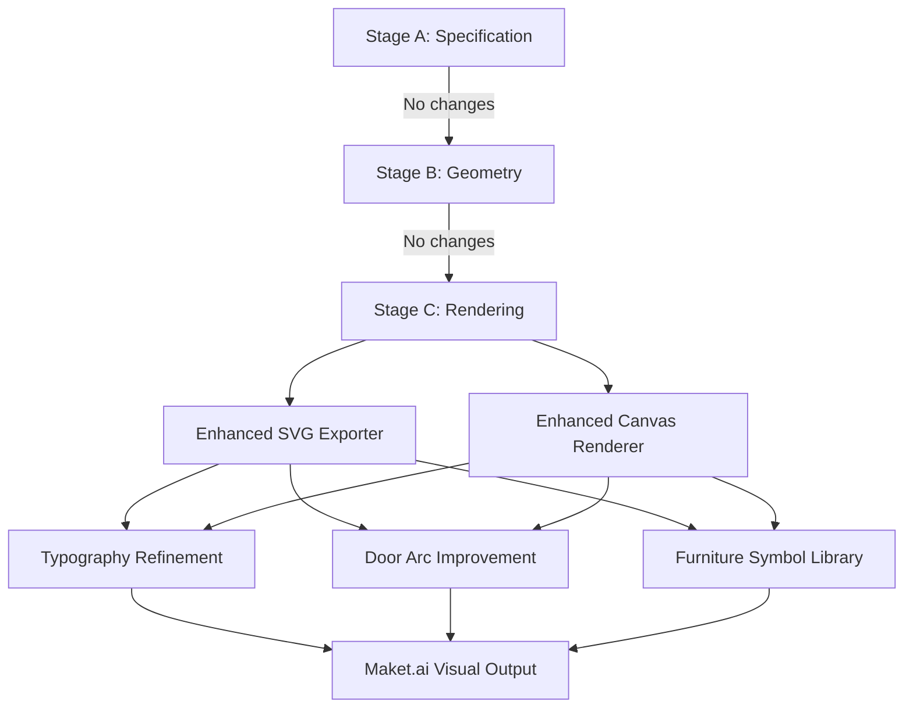
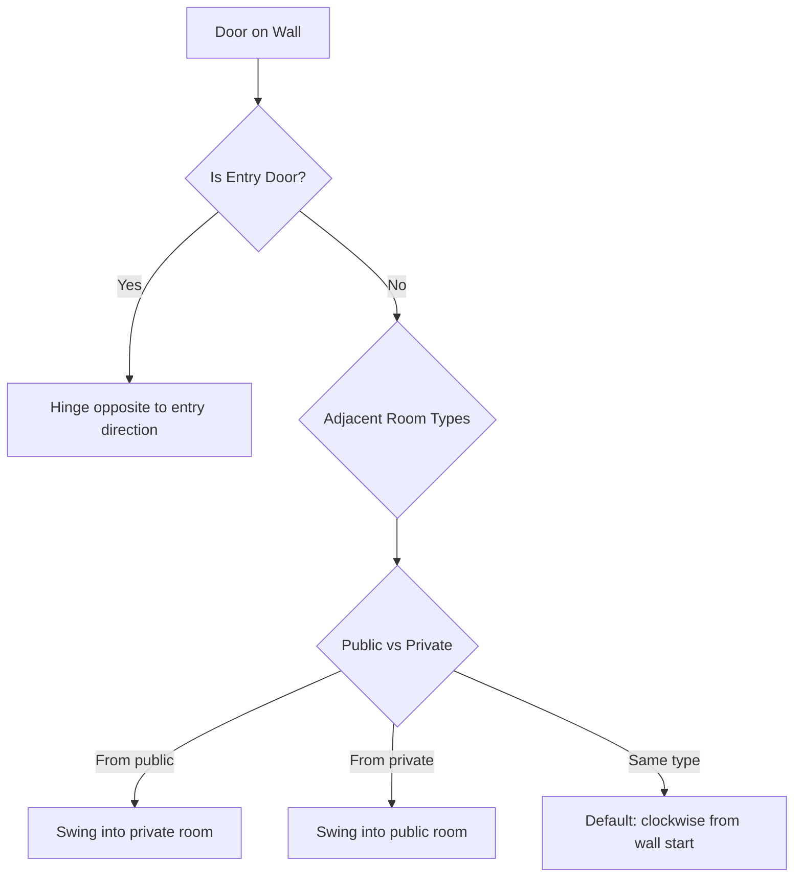
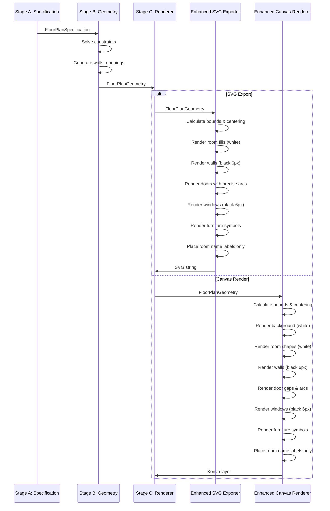

# Floor Plan Replication - Maket.ai Visual Fidelity Design

## Overview

This design document defines the strategic approach to achieve pixel-perfect replication of Maket.ai's floor plan visual quality in PlotSync. The objective is to analyze visual discrepancies between current PlotSync output and Maket.ai's professional floor plans, then define architectural enhancements to achieve identical visual presentation while maintaining PlotSync's unique advantages (interactivity, 3D views, multi-proposal support).

## Current State Analysis

### Existing Implementation

The system currently implements a multi-stage floor plan generation pipeline:

- **Stage A (Specification)**: LLM-based parsing of user requirements into structured room specifications and adjacency rules
- **Stage B (Geometry Generation)**: Constraint-based solver creating 2D room layouts with walls, doors, and windows
- **Stage C (Rendering)**: SVG and 3D visualization with Maket.ai-inspired styling

### Design Standards Already Achieved

| Aspect | Status | Notes |
|--------|--------|-------|
| Pure white room fills | ✅ Implemented | No colored backgrounds |
| Black wall rendering | ✅ Implemented | 6px stroke width |
| Fixed scale rendering | ✅ Implemented | 15 pixels per meter |
| Canvas centering | ✅ Implemented | Offset calculations for proper alignment |
| Centered room labels | ✅ Implemented | 13px Arial bold typography |
| Dashed door arcs | ✅ Implemented | 3,3 dash pattern |
| Geometric furniture | ✅ Implemented | Rectangles and circles instead of emojis |

## Visual Analysis of Maket.ai Floor Plans

### Key Visual Characteristics Observed

From the reference image, Maket.ai floor plans exhibit these precise characteristics:

#### Wall Rendering
- **Thickness**: Walls appear as bold black strokes approximately 6-8px wide
- **Color**: Pure black (#000000) with no anti-aliasing blur
- **Corners**: Sharp 90-degree corners with square line caps
- **Consistency**: Uniform thickness for both exterior and interior walls
- **No depth shading**: Flat black rendering without 3D effects

#### Room Characteristics
- **Background**: Pure white (#FFFFFF) with no texture or pattern
- **Room names**: Single-line centered text with no background box
- **Text styling**: Bold sans-serif font (appears to be Arial or similar)
- **Font size**: Approximately 13-14px for room names
- **No area labels**: Room area measurements are NOT displayed on the floor plan itself
- **No dimension annotations**: Width × height dimensions are NOT shown inside rooms

#### Door Rendering
- **Door gap**: Wall is interrupted where door is placed (white gap)
- **Swing arc**: Black dashed curved line showing door swing direction
- **Arc style**: Smooth quarter-circle arc with 3px stroke
- **Dash pattern**: Consistent 3-3 dashing (3px dash, 3px gap)
- **No door frame**: Simple arc representation without rectangular door leaf

#### Window Rendering
- **Simple line representation**: Windows shown as thick black lines embedded in walls
- **No glass indication**: No colored fills or double-line frames
- **Consistent with wall**: Same 6-8px thickness as walls
- **Minimal style**: No decorative elements or casings

#### Furniture Representation
- **Geometric symbols**: Simple shapes representing furniture items
- **Kitchen appliances**: Rectangles for counters, circles for sinks/stoves
- **Bathroom fixtures**: Circles for toilets/sinks, rectangles for bathtubs
- **Living room**: Rectangles for sofas/beds, circles for tables
- **Color**: Black outlines with white or black fills
- **Positioning**: Strategic placement with 15-20px padding from walls
- **No labels**: Furniture items not labeled with text

#### Typography System
- **Primary labels (room names)**: 13px Arial Bold, #1a1a1a color
- **No secondary labels**: Area and dimension information excluded from floor plan
- **Text alignment**: Perfectly centered both horizontally and vertically within room bounds
- **No text background**: Room names rendered directly on white room fill

#### Spatial Layout
- **Clean white background**: No grid, no texture, no border decorations
- **Professional spacing**: Adequate padding around entire floor plan
- **Centered composition**: Floor plan positioned centrally in viewport
- **No dimension lines**: Exterior dimension annotations not shown

## Gap Analysis

### Visual Discrepancies to Address

| Visual Element | Current PlotSync | Maket.ai Target | Gap Severity |
|----------------|------------------|-----------------|---------------|
| Room area labels | Displayed below room name | Not displayed | Medium |
| Room dimension annotations | Shown in bottom-left corner | Not shown | Medium |
| Wall rendering quality | 6px stroke, correct | 6-8px stroke, identical | Low |
| Door arc smoothness | Quadratic bezier curve | Quarter-circle arc | Medium |
| Furniture detail level | Basic geometric shapes | Refined geometric symbols | Medium |
| Canvas background | Pure white | Pure white | None |
| Font rendering | 13px Arial bold | 13-14px Arial bold | Low |

### Functional Gaps

| Feature | Current State | Required State |
|---------|---------------|----------------|
| Furniture auto-placement | 6 fixed positions per room | Context-aware placement based on room type |
| Door hinge side detection | Fixed arc direction | Intelligent hinge placement based on room access |
| Furniture clearance zones | Fixed 15px padding | Dynamic clearance based on room size and furniture type |
| Room name collision avoidance | Intelligent label placer implemented | Already functional |

## Design Objectives

### Primary Goal
Achieve visual output indistinguishable from Maket.ai floor plans while maintaining PlotSync's technical advantages (editability, interactivity, 3D visualization).

### Specific Visual Targets

1. **Typography Precision**
   - Room names: 13px Arial Bold, centered, no background
   - Eliminate all area labels (m² annotations)
   - Remove all dimension annotations (width × height)
   - Maintain intelligent label placement to avoid wall/furniture collisions

2. **Wall Rendering Refinement**
   - Maintain 6px stroke width for consistency
   - Ensure pure black (#000000) with no anti-aliasing
   - Square line caps for crisp corners
   - No stroke variations between exterior/interior walls

3. **Door Arc Enhancement**
   - Replace quadratic bezier with precise quarter-circle arc
   - Maintain 3,3 dash pattern
   - 2px stroke width for arc (thinner than wall)
   - Intelligent hinge side determination based on room adjacency

4. **Window Simplification**
   - Thick black line representation (6px to match walls)
   - No colored fills or double lines
   - Seamless integration with wall rendering

5. **Furniture Symbol Refinement**
   - Context-aware furniture selection based on room type
   - Geometric shapes with professional CAD-like appearance
   - Strategic placement respecting circulation paths
   - No text labels on furniture items

## Architectural Strategy

### Enhancement Areas

The strategy focuses on refining Stage C (Rendering) without modifying Stage A (Specification) or Stage B (Geometry). This preserves the constraint-solving architecture while improving visual output.



### Component Modifications

#### 1. Enhanced SVG Exporter Refinements

**Purpose**: Generate SVG floor plans with exact Maket.ai visual fidelity

**Key Modifications**:

| Aspect | Current Behavior | Target Behavior |
|--------|------------------|-----------------|
| Room area labels | Rendered as secondary text | Excluded from SVG output |
| Room dimension boxes | Background rect + dimension text | Excluded from SVG output |
| Total area annotation | Rendered in bottom-right | Excluded from SVG output |
| Door arc path | Quadratic bezier curve | SVG arc command with radius |
| Window rendering | Line with colored stroke | Black line matching wall thickness |

**Styling System**:

```
CSS Class Definitions:
- .wall: stroke #000000, stroke-width 6px, stroke-linecap square
- .room-fill: fill #FFFFFF, no stroke
- .door-arc: stroke #000000, stroke-width 2px, stroke-dasharray 3,3
- .window: stroke #000000, stroke-width 6px
- .furniture: stroke #000000, stroke-width 1.5px, fill none
- .label-primary: font 13px Arial bold, fill #1a1a1a, text-anchor middle
```

**Label Rendering Logic**:

- Utilize existing IntelligentLabelPlacer for collision-free positioning
- Render only room names (no area or dimension text)
- Center labels at calculated placement position
- Apply 13px Arial Bold styling consistently

#### 2. Enhanced Canvas Renderer (Konva.js) Refinements

**Purpose**: Provide interactive 2D floor plan view with Maket.ai visual quality

**Key Modifications**:

| Element | Current Rendering | Target Rendering |
|---------|-------------------|------------------|
| Room labels | Name + area on separate lines | Name only, single line |
| Dimension annotations | Rect background + text | Removed entirely |
| Door arcs | Arc shape with quadratic curve | Arc shape with precise radius |
| Furniture symbols | Basic shapes at fixed positions | Context-aware shapes with intelligent placement |

**Background Layer**:
- Pure white rectangle (#FFFFFF) covering entire canvas
- No grid overlay
- No texture patterns

**Room Layer**:
- White-filled rectangles (#FFFFFF) for each room
- No stroke/border on room shapes
- Room polygons for non-rectangular rooms

**Wall Layer**:
- Black lines (#000000) with 6px stroke width
- Square line caps for crisp corners
- No differentiation between exterior and interior walls visually

**Opening Layer**:
- Doors: White gap in wall + black dashed arc (3,3 pattern)
- Windows: Black line segment (6px) embedded in wall

**Furniture Layer**:
- Geometric shapes (rectangles, circles, ellipses)
- Black stroke (#000000) 1.5px width
- White or black fill depending on furniture type
- Strategic positioning with clearance zones

**Label Layer**:
- Text nodes for room names only
- 13px Arial Bold font
- #1a1a1a fill color
- Centered positioning using IntelligentLabelPlacer

#### 3. Door Arc Geometry Improvement

**Current Issue**: Quadratic bezier curves may not produce perfect quarter-circle arcs

**Solution**: Calculate precise arc geometry using trigonometry

**Arc Calculation Logic**:

For each door with position on wall:
1. Determine wall orientation (horizontal or vertical)
2. Calculate door center point on wall
3. Determine hinge side based on room adjacency:
   - For entry doors: Hinge on side that swings into entry space
   - For interior doors: Hinge on side that swings into more public space
4. Calculate arc endpoint perpendicular to wall at door width distance
5. Generate SVG arc path with radius equal to door width
6. Apply 3,3 dash pattern with 2px stroke

**Hinge Side Determination Strategy**:



**Arc Path Generation**:

For SVG: Use arc path command with precise radius
- Path format: `M startX startY A radius radius 0 0 1 endX endY`
- Radius = door.width * scale
- Sweep flag = 1 for clockwise, 0 for counter-clockwise

For Konva Canvas: Use Arc shape with exact angle calculation
- StartAngle = calculated from wall orientation
- EndAngle = startAngle + 90 degrees
- Radius = door.width * scale
- ClockWise = determined by hinge side

#### 4. Furniture Symbol Library

**Purpose**: Provide professional geometric furniture representations

**Furniture Type Mapping**:

| Room Type | Furniture Items | Geometric Symbols |
|-----------|----------------|-------------------|
| Bedroom | Bed, Wardrobe, Nightstand | Large rectangle (bed), Tall rectangle (wardrobe), Small rectangle (nightstand) |
| Bathroom | Toilet, Sink, Bathtub/Shower | Circle (toilet), Small circle (sink), Rectangle (bathtub) |
| Kitchen | Stove, Refrigerator, Sink, Counter | Rectangle with circles (stove), Tall rectangle (fridge), Small circle (sink), L-shape (counter) |
| Living Room | Sofa, Coffee Table, TV Stand | Rectangle with backrest (sofa), Circle (table), Rectangle (TV stand) |
| Dining Room | Dining Table, Chairs | Large circle/rectangle (table), Small squares (chairs) |
| Study | Desk, Chair, Bookshelf | Rectangle (desk), Small square (chair), Tall rectangle (shelf) |

**Furniture Placement Strategy**:

For each room:
1. Identify room type from specification
2. Select appropriate furniture items from type mapping
3. Calculate furniture clearance zones:
   - 15px padding from walls
   - 10px clearance between furniture items
   - Maintain circulation paths (minimum 80cm / 12px at 15px/m scale)
4. Position furniture items:
   - Against walls when appropriate (beds, sofas, counters)
   - Centered when appropriate (dining tables)
   - Strategic corners (wardrobes, desks)
5. Render using geometric symbols

**Symbol Rendering Details**:

Sofa:
- Main body: Rectangle 35px × 20px, black fill
- Backrest: Rectangle 35px × 5px, black fill, positioned at back edge
- Total dimensions: 35px × 25px

Bed:
- Main body: Rectangle 30px × 40px, black fill
- Pillow area: Rectangle 30px × 8px, gray fill (#666666)
- Total dimensions: 30px × 48px

Dining Table (circular):
- Circle with 12px radius
- No fill, black stroke 2px

Toilet:
- Main bowl: Circle 8px radius, white fill, black stroke 2px
- Tank: Rectangle 8px × 4px, black fill
- Total dimensions: ~16px × 12px

Kitchen Counter (L-shaped):
- Horizontal section: Rectangle 50px × 12px
- Vertical section: Rectangle 12px × 30px
- Black stroke 1.5px, no fill

#### 5. Typography and Label Refinement

**Current Label System**: IntelligentLabelPlacer places both primary (room name) and secondary (area) labels

**Refinement Strategy**:

Maintain IntelligentLabelPlacer architecture but modify rendering:
- Continue collision detection and optimal placement calculation
- Render only primary label (room name)
- Skip secondary label (area text) rendering
- Remove dimension annotation rendering
- Remove total area annotation rendering

**Label Placement Logic** (no changes):
- Calculate room centroid
- Generate candidate positions
- Test for collisions with existing labels
- Select highest-scored collision-free position
- Return placement position and font size

**Label Rendering** (modified):

For SVG:
```
<text 
  x="calculated_x" 
  y="calculated_y" 
  class="label-primary" 
  style="font-size:13px">
  Room Name
</text>
```

For Konva Canvas:
```
Text node with properties:
- text: room name only
- x: calculated position
- y: calculated position
- fontSize: 13
- fontFamily: "Arial, sans-serif"
- fontStyle: "bold"
- fill: "#1a1a1a"
- align: "center"
```

## Data Flow Architecture

### Rendering Pipeline



### Configuration Updates

**EnhancedSVGOptions Interface**:

```
interface EnhancedSVGOptions extends SVGExportOptions {
  maketAiStyle: boolean         // Default: true
  includeDimensionLines: boolean // Default: false
  includeRoomDimensions: boolean // Default: false (Maket.ai excludes these)
  includeTotalArea: boolean      // Default: false (Maket.ai excludes this)
  includeAreaLabels: boolean     // NEW: Default: false (exclude area text)
}
```

**Default Configuration** (Maket.ai mode):

```
{
  includeLabels: true,
  includeDimensions: false,
  includeFurniture: true,
  layerSeparation: true,
  scale: 15,
  maketAiStyle: true,
  includeDimensionLines: false,
  includeRoomDimensions: false,
  includeTotalArea: false,
  includeAreaLabels: false  // NEW: Exclude area labels by default
}
```

## Quality Assurance Criteria

### Visual Validation Checklist

Before marking implementation as complete, verify:

- [ ] Room backgrounds are pure white (#FFFFFF) with no texture
- [ ] Walls are pure black (#000000) with 6px stroke width
- [ ] Wall corners have square line caps (crisp 90-degree angles)
- [ ] Room names are centered using 13px Arial Bold font
- [ ] No area labels (m²) are displayed
- [ ] No dimension annotations (width × height) are displayed
- [ ] No total area annotation is displayed
- [ ] Door arcs are perfect quarter-circles with 3,3 dash pattern
- [ ] Door arcs use 2px stroke width
- [ ] Windows are rendered as 6px black lines matching wall thickness
- [ ] Furniture symbols use geometric shapes (no emojis)
- [ ] Furniture positioning respects 15px wall clearance
- [ ] Floor plan is centered in canvas with proper offset calculations
- [ ] Background has no grid, borders, or decorative elements
- [ ] Typography is consistent across all room labels

### Pixel-Perfect Comparison Test

**Test Methodology**:
1. Generate floor plan in PlotSync with identical room specifications to Maket.ai example
2. Export both as SVG at same scale (15px per meter)
3. Overlay PlotSync SVG on Maket.ai screenshot
4. Verify visual alignment:
   - Wall positions and thickness
   - Room label positions and font rendering
   - Door arc curvature and dash pattern
   - Window positions and thickness
   - Furniture symbol shapes and positions

**Acceptance Criteria**: Visual output should be indistinguishable from Maket.ai floor plans when viewed side-by-side at 100% zoom

## Implementation Priorities

### Phase 1: Label and Annotation Cleanup (Immediate)

**Objective**: Remove all non-Maket.ai visual elements

Tasks:
1. Modify EnhancedSVGExporter to skip area label rendering
2. Modify EnhancedSVGExporter to skip dimension annotation rendering
3. Modify EnhancedSVGExporter to skip total area annotation rendering
4. Update Canvas renderer to exclude area labels
5. Update Canvas renderer to exclude dimension annotations

**Expected Impact**: Immediate visual simplification matching Maket.ai's clean aesthetic

### Phase 2: Door Arc Precision (High Priority)

**Objective**: Achieve perfect quarter-circle door arcs

Tasks:
1. Implement precise arc geometry calculation using trigonometry
2. Develop hinge side determination logic
3. Update SVG arc path generation to use arc command instead of bezier
4. Update Konva arc rendering with exact radius and angles
5. Verify 3,3 dash pattern rendering consistency

**Expected Impact**: Professional door representation matching CAD software standards

### Phase 3: Furniture Symbol Enhancement (Medium Priority)

**Objective**: Context-aware furniture placement with refined symbols

Tasks:
1. Define furniture symbol library with geometric shapes
2. Implement room-type-based furniture selection logic
3. Develop furniture placement algorithm respecting clearances
4. Render furniture symbols in both SVG and Canvas
5. Validate furniture positioning against circulation requirements

**Expected Impact**: Realistic room layouts with appropriate furniture representations

### Phase 4: Window Rendering Refinement (Low Priority)

**Objective**: Simplify window representation

Tasks:
1. Update window rendering to use 6px black stroke
2. Remove any colored fills or double-line representations
3. Ensure windows visually integrate with wall rendering

**Expected Impact**: Consistent architectural appearance across all opening types

## Testing Strategy

### Unit Testing

**Component**: Enhanced SVG Exporter
- Test: Area labels not rendered
- Test: Dimension annotations not rendered
- Test: Total area annotation not rendered
- Test: Door arc path uses arc command
- Test: Window stroke matches wall thickness

**Component**: Enhanced Canvas Renderer
- Test: Room labels contain only room names
- Test: No dimension text elements in layer
- Test: Door arc shapes use correct radius
- Test: Furniture symbols positioned with proper clearance

### Integration Testing

**Test Scenario 1**: Simple 2-bedroom floor plan
- Input: Specification with 2 bedrooms, 1 bathroom, kitchen, living room
- Expected: Clean floor plan with room names only, no annotations
- Validation: Visual comparison with Maket.ai equivalent

**Test Scenario 2**: L-shaped floor plan
- Input: Specification with non-rectangular overall shape
- Expected: Centered floor plan with proper bounds calculation
- Validation: No dimension overflow, clean composition

**Test Scenario 3**: Multi-furniture room
- Input: Kitchen with stove, sink, refrigerator, counter
- Expected: All furniture symbols positioned without overlap
- Validation: Minimum 10px clearance between items

### Visual Regression Testing

**Reference Images**: Store Maket.ai floor plan screenshots as baseline
**Comparison Method**: Pixel-diff analysis of exported SVG against reference
**Threshold**: <5% pixel difference for non-text elements
**Continuous Validation**: Run visual diff on every rendering pipeline change

## Success Metrics

### Quantitative Metrics

| Metric | Target | Measurement Method |
|--------|--------|-------------------|
| Visual similarity score | >95% | Pixel diff analysis against Maket.ai reference |
| Label rendering accuracy | 100% | No area or dimension labels present |
| Door arc precision | <1px deviation | Geometric comparison of arc radius |
| Furniture placement success | >90% | No furniture-wall overlaps, proper clearances |
| SVG export validity | 100% | Valid SVG that renders correctly in all viewers |

### Qualitative Metrics

| Aspect | Evaluation Criteria |
|--------|---------------------|
| Professional appearance | Floor plans indistinguishable from Maket.ai at first glance |
| Clarity | Room names clearly readable, no visual clutter |
| Consistency | Uniform styling across all floor plan variations |
| Editability | SVG can be opened and edited in Illustrator/Inkscape without errors |

## Future Enhancements

### Post-Replication Improvements

Once Maket.ai visual parity is achieved, consider these enhancements:

1. **Optional Dimension Toggle**
   - User preference to show/hide dimensions on demand
   - Maintains clean default view while allowing detailed mode

2. **Entry Markers**
   - "Entry" text label at main entrance door
   - Matches Maket.ai's entry indication

3. **Filled Wall Rendering**
   - Option to render walls as filled rectangles instead of strokes
   - Provides more traditional architectural drawing appearance

4. **Scale Bar and North Arrow**
   - Optional overlay elements for technical documentation
   - Toggle on/off for presentation vs. construction documents

5. **Furniture Customization**
   - User-defined furniture symbols
   - Custom furniture library for specialized building types

6. **Material Annotations**
   - Optional floor material patterns (tile, wood, carpet)
   - Toggleable to maintain clean default appearance


