# Floor Plan Visual Display Enhancement

## Overview

This design addresses the visual inconsistency in floor plan display sizes, where small-area floor plans (e.g., 50 m²) appear too small to be usable, while large-area floor plans (e.g., 2000 m²) display at an appropriate size. The system currently uses a fixed scale of 15 pixels per meter across all floor plans, which results in proportionally small visual output for compact floor plans.

**Objective**: Ensure all floor plans display at a consistently large, readable size regardless of their actual area, while clearly communicating actual dimensions through labels and annotations.

**Secondary Objective**: Remove icon-based furniture symbols and replace with professional geometric shapes and text-based room labels with dimensions.

---

## Problem Statement

### Current Behavior

The floor plan rendering system applies a uniform scaling strategy:
- **Scale Factor**: 15 pixels per meter (fixed for all floor plans)
- **Visual Result**: 
  - 50 m² floor plan (e.g., 10m × 5m) → 150px × 75px display (too small)
  - 2000 m² floor plan (e.g., 50m × 40m) → 750px × 600px display (appropriate)

### Issues Identified

1. **Disproportionate Visual Size**
   - Small floor plans appear tiny and difficult to read
   - Details (room labels, furniture, doors) become cramped or illegible
   - User experience is poor for compact floor plans

2. **Icon-Based Furniture Symbols**
   - Current implementation uses emoji icons (🛏️, 🛋️, 🚽)
   - Icons do not align with Maket.ai professional design standard
   - Geometric symbols preferred for architectural fidelity

3. **Inconsistent User Experience**
   - Users generating small apartments receive inadequate visual feedback
   - Comparison between proposals of different sizes is difficult

### User Requirements

- **Consistent Large Display**: All floor plans should appear visually prominent, regardless of actual area
- **Dimension Communication**: Actual measurements must be clearly labeled (wall lengths, room areas, room dimensions)
- **Professional Symbols**: Replace icon-based furniture with geometric shapes
- **Text-Based Labels**: Room names with dimension annotations (width × height, area in m²)

---

## Design Goals

### Primary Goals

1. **Adaptive Scaling Strategy**
   - Dynamically calculate scale factor based on floor plan dimensions
   - Ensure minimum visual size for all floor plans
   - Maintain aspect ratio and proportional relationships

2. **Minimum Display Size Enforcement**
   - Define minimum acceptable canvas utilization (e.g., 400px × 300px)
   - Scale up small floor plans to meet minimum threshold
   - Cap maximum scale to prevent over-magnification

3. **Professional Visual Style (Maket.ai Alignment)**
   - Pure white room backgrounds
   - Bold black walls (6px in SVG, 4px in Canvas)
   - Geometric furniture symbols (rectangles, circles, lines)
   - Clean text-based labels (room name, dimensions, area)

### Secondary Goals

4. **Dimension Label Enhancement**
   - Wall lengths displayed at midpoints
   - Room dimensions shown as "width × height"
   - Room areas displayed in m²
   - Clear visual hierarchy in label typography

5. **Canvas Centering Refinement**
   - Proper offset calculations for all floor plan sizes
   - Consistent padding regardless of scale factor
   - Horizontal and vertical centering

---

## Architecture

### Component Responsibilities


### Data Flow


---

## Adaptive Scaling Strategy

### Scaling Algorithm

#### Step 1: Calculate Floor Plan Bounds

Extract minimum and maximum coordinates from all geometric elements (walls, rooms).

**Input**: Floor plan geometry data
- Walls: Array of `{ x1, y1, x2, y2 }`
- Rooms: Array of `{ x, y, width, height }`

**Output**: Bounding box
- `minX`, `minY`: Lower-left corner
- `maxX`, `maxY`: Upper-right corner
- `planWidth`: `maxX - minX`
- `planHeight`: `maxY - minY`

#### Step 2: Determine Adaptive Scale Factor

**Goal**: Ensure minimum display size while preventing over-magnification

| Parameter | Value | Rationale |
|-----------|-------|-----------|
| **Minimum Display Width** | 500 pixels | Ensures readability on standard screens |
| **Minimum Display Height** | 400 pixels | Maintains vertical readability |
| **Maximum Scale Factor** | 25 pixels/meter | Prevents excessive zoom for very small plans |
| **Minimum Scale Factor** | 10 pixels/meter | Maintains reasonable detail for large plans |
| **Default Scale Factor** | 15 pixels/meter | Baseline for moderate floor plans |

**Calculation Logic**:

1. Calculate scale required to meet minimum display width: `scaleX = MIN_DISPLAY_WIDTH / planWidth`
2. Calculate scale required to meet minimum display height: `scaleY = MIN_DISPLAY_HEIGHT / planHeight`
3. Select the larger of the two: `minRequiredScale = max(scaleX, scaleY)`
4. Apply constraints: `scale = clamp(minRequiredScale, MIN_SCALE, MAX_SCALE)`
5. Use constrained scale for rendering

**Example Scenarios**:

| Floor Plan | Dimensions | planWidth | planHeight | Calculated Scale | Final Scale |
|------------|-----------|-----------|------------|------------------|-------------|
| Small Apartment | 10m × 5m | 10m | 5m | max(500/10, 400/5) = 80 | 25 (capped) |
| Medium House | 20m × 15m | 20m | 15m | max(500/20, 400/15) = 26.67 | 25 (capped) |
| Large Villa | 50m × 40m | 50m | 40m | max(500/50, 400/40) = 10 | 10 (meets min) |
| Very Large Estate | 100m × 80m | 100m | 80m | max(500/100, 400/80) = 5 | 10 (enforced min) |

#### Step 3: Compute Centering Offsets

**Goal**: Center the floor plan within the canvas regardless of scale

**Canvas Dimensions**: `width × height` (available display area)

**Offset Calculation**:
- `scaledWidth = planWidth × scale`
- `scaledHeight = planHeight × scale`
- `offsetX = (width - scaledWidth) / 2 - minX × scale`
- `offsetY = (height - scaledHeight) / 2 - minY × scale`

**Purpose**:
- First term `(width - scaledWidth) / 2`: Centers the scaled floor plan
- Second term `- minX × scale`: Adjusts for floor plan origin offset

---

## Visual Style Refinements

### Room Rendering

**Current Implementation**: Rooms with white backgrounds and icon-based furniture

**Enhanced Design**:
- **Room Fill**: Pure white (`#FFFFFF`)
- **Room Border**: None (walls define boundaries)
- **Room Labels** (3-tier hierarchy):
  1. **Room Name** (Primary)
     - Font: 13px Arial Bold
     - Color: `#1a1a1a` (dark black)
     - Position: Centered, offset Y = -10px from room center
  2. **Room Dimensions** (Secondary)
     - Font: 10px Arial Regular
     - Color: `#666666` (medium gray)
     - Format: `"width × height m"` (e.g., "4.0m × 5.0m")
     - Position: Centered, offset Y = +5px from room center
  3. **Room Area** (Tertiary)
     - Font: 10px Arial Regular
     - Color: `#666666` (medium gray)
     - Format: `"XX.X m²"`
     - Position: Centered, offset Y = +18px from room center

### Furniture Symbol Rendering

**Replacement Strategy**: Remove emoji icons, introduce geometric primitives

**Furniture Symbol Catalog**:

| Furniture Type | Geometric Representation | Dimensions | Stroke |
|----------------|-------------------------|------------|--------|
| **Bed** | Rectangle with pillow line | 30px × 40px | 1.5px black |
| **Sofa** | Rectangle with backrest rectangle | 35px × 20px | 1.5px black |
| **Table** | Circle | Radius: 12px | 2px black outline |
| **Toilet** | Circle + small rectangle (tank) | Circle: 8px radius | 2px black |
| **Sink/Shower** | Rectangle | 25px × 18px | 2px black outline |
| **Stove/Refrigerator** | Rectangle with detail circles | 20px × 25px | 2px black |
| **Chair** | Small square | 12px × 12px | 1.5px black |
| **Default** | Small circle | Radius: 8px | 1.5px black |

**Placement Strategy**:
- Position furniture with 15px padding from room edges
- Distribute across 6 predefined locations (top-left, top-right, bottom-left, bottom-right, top-center, bottom-center)
- Cycle through positions based on furniture index

### Wall and Opening Rendering

**Specifications** (unchanged from Maket.ai standard):

| Element | Canvas Stroke | SVG Stroke | Color | Line Cap | Notes |
|---------|--------------|-----------|-------|----------|-------|
| **Walls** | 4px | 6px | `#000000` | Square | Bold black lines |
| **Windows** | 4px | 6px | `#000000` | Square | Matches wall thickness |
| **Door Gap** | 6px | 8px | `#FFFFFF` | Butt | White line in wall |
| **Door Arc** | 2.5px | 2px | `#000000` | Round | Dashed (3,3 pattern) |

**Rationale for Dual Stroke Widths**:
- Canvas mode (Konva): Anti-aliasing adds ~2px visual weight, so use thinner strokes (4px)
- SVG mode: Browser rendering is sharper, use thicker strokes (6px) to match Maket.ai

---

## Label Placement System

### Dimension Label Rendering

#### Wall Length Labels

**Placement**:
- Position: Midpoint of wall, offset 15px perpendicular to wall direction
- Rotation: Follows wall angle for readability
- Visibility Threshold: Only display if wall length > 5 meters

**Typography**:
- Font: 11px Arial Bold
- Color: `#666666` (medium gray)
- Format: `"XX.X m"`

**Rotation Logic**:
- Calculate wall angle: `angle = atan2(y2 - y1, x2 - x1) × (180 / π)`
- Adjust for readability: If angle > 90° or angle < -90°, rotate by +180°

#### Room Dimension Labels

**Three-Tier Label System**:

```mermaid
graph TB
    A[Room Center] --> B[Room Name]
    A --> C[Room Dimensions]
    A --> D[Room Area]
    
    B --> B1["Font: 13px Arial Bold"]
    B --> B2["Color: #1a1a1a"]
    B --> B3["Position: centerY - 10px"]
    
    C --> C1["Font: 10px Arial Regular"]
    C --> C2["Color: #666666"]
    C --> C3["Format: width × height m"]
    C --> C4["Position: centerY + 5px"]
    
    D --> D1["Font: 10px Arial Regular"]
    D --> D2["Color: #666666"]
    D --> D3["Format: XX.X m²"]
    D --> D4["Position: centerY + 18px"]
```



**Alignment**: All labels centered horizontally at `centerX`

---

## Implementation Workflow

### Phase 1: Scale Calculation Enhancement

**Component**: `floor-plan-canvas.tsx`

**Changes**:
1. Replace fixed scale constant with adaptive scale function
2. Implement bounds calculation from geometry data
3. Calculate minimum required scale based on display thresholds
4. Apply min/max scale constraints
5. Update centering offset calculations to use adaptive scale

**Affected Section**: Lines 180-195 (current scale calculation logic)

### Phase 2: Furniture Symbol Replacement

**Component**: `floor-plan-canvas.tsx`

**Changes**:
1. Remove `getFurnitureSymbol()` function (emoji-based)
2. Enhance `renderFurnitureShape()` function with geometric primitives
3. Implement professional furniture symbol catalog (bed, sofa, table, etc.)
4. Apply Konva shapes (Rect, Circle, Line) for each furniture type
5. Position furniture with 15px padding and 6-location placement logic

**Affected Section**: Lines 475-522 (furniture rendering logic)

### Phase 3: Room Label Refinement

**Component**: `floor-plan-canvas.tsx`

**Changes**:
1. Update room label rendering to three-tier system
2. Apply typography specifications (font size, weight, color)
3. Position labels at calculated offsets from room center
4. Remove area labels if not explicitly requested

**Affected Section**: Lines 340-380 (room label rendering)

### Phase 4: SVG Exporter Alignment

**Component**: `enhanced-svg-exporter.ts`

**Changes**:
1. Update default scale from 15 to use adaptive calculation (if applicable for exports)
2. Ensure consistency between Canvas and SVG rendering modes
3. Verify dimension label formatting matches Canvas output

**Affected Section**: Constructor and scale parameter (line 18)

---

## Configuration Updates

### Scale Parameters

**File**: `lib/floor-plan/config.ts`

**New Configuration Section**:

| Parameter | Value | Description |
|-----------|-------|-------------|
| `ADAPTIVE_SCALE.minDisplayWidth` | 500 pixels | Minimum floor plan width in pixels |
| `ADAPTIVE_SCALE.minDisplayHeight` | 400 pixels | Minimum floor plan height in pixels |
| `ADAPTIVE_SCALE.maxScale` | 25 pixels/meter | Maximum zoom level |
| `ADAPTIVE_SCALE.minScale` | 10 pixels/meter | Minimum zoom level |
| `ADAPTIVE_SCALE.defaultScale` | 15 pixels/meter | Baseline for moderate plans |

**Purpose**: Centralized configuration for adaptive scaling thresholds

---

## Testing Strategy

### Unit Testing

**Test Suite**: `floor-plan-canvas.test.tsx`

#### Test Cases: Adaptive Scale Calculation

| Test Case | Input | Expected Output | Validation |
|-----------|-------|----------------|------------|
| Very small floor plan | 5m × 4m | scale = 25 (max cap) | Meets minimum display size |
| Small apartment | 10m × 8m | scale = 25 (max cap) | Readable and prominent |
| Medium house | 20m × 15m | scale = 25 (calculated) | Balanced display |
| Large villa | 50m × 40m | scale = 10 (min enforced) | Full visibility |
| Very large estate | 100m × 80m | scale = 10 (min enforced) | Prevents tiny display |

#### Test Cases: Furniture Symbol Rendering

| Test Case | Furniture Type | Expected Shape | Validation |
|-----------|----------------|----------------|------------|
| Bed symbol | "bed" | Rectangle + pillow line | No emoji, geometric only |
| Sofa symbol | "sofa" | Rectangle + backrest | Professional appearance |
| Table symbol | "table" | Circle | Consistent stroke width |
| Toilet symbol | "toilet" | Circle + tank rectangle | Clear representation |

#### Test Cases: Label Placement

| Test Case | Room Size | Expected Behavior | Validation |
|-----------|-----------|-------------------|------------|
| Large room (20 m²) | 5m × 4m | All 3 labels visible | No overlap |
| Medium room (12 m²) | 4m × 3m | All 3 labels visible | Proper spacing |
| Small room (6 m²) | 3m × 2m | All 3 labels visible | Labels legible |

### Integration Testing

**Test Scenario**: Multi-proposal comparison

1. Generate 5 proposals with varying total areas (50 m², 100 m², 150 m², 200 m², 250 m²)
2. Verify all proposals display at similar visual sizes
3. Confirm dimension labels accurately reflect actual measurements
4. Validate furniture symbols are geometric (no emojis)
5. Ensure room labels follow 3-tier hierarchy

---

## Edge Cases

### Edge Case 1: Very Narrow Floor Plans

**Scenario**: Floor plan with extreme aspect ratio (e.g., 50m × 2m)

**Challenge**: Adaptive scale may over-magnify the short dimension

**Solution**:
- Calculate separate scale factors for width and height
- Use the minimum of the two to prevent over-magnification of one dimension
- Apply max scale cap (25 pixels/meter) to prevent excessive zoom

**Handling**:
```
scaleX = MIN_DISPLAY_WIDTH / planWidth
scaleY = MIN_DISPLAY_HEIGHT / planHeight
minRequiredScale = max(scaleX, scaleY)
finalScale = min(minRequiredScale, MAX_SCALE)
```

### Edge Case 2: Very Small Rooms with Multiple Labels

**Scenario**: Room < 3m² with 3-tier label system

**Challenge**: Labels may overlap or extend beyond room boundaries

**Solution**:
- Define minimum room size threshold for label visibility (e.g., 2m²)
- For rooms below threshold, display only room name (omit dimensions and area)
- Reduce font sizes proportionally for very small rooms (8px instead of 10px)

**Conditional Logic**:
- If `room area < 2 m²`: Display name only, font = 10px
- If `room area >= 2 m² and < 5 m²`: Display name + area, font = 10px
- If `room area >= 5 m²`: Display full 3-tier labels, font = 10px/13px

### Edge Case 3: Zero or Negative Coordinates

**Scenario**: Floor plan geometry includes rooms with negative coordinates (e.g., x = -10, y = -5)

**Challenge**: Offset calculations may place floor plan outside visible canvas

**Solution**:
- Bounds calculation already accounts for negative coordinates via `minX` and `minY`
- Centering offset formula adjusts for origin: `offsetX = (width - scaledWidth) / 2 - minX × scale`
- If `minX < 0`, the subtraction adds positive offset to shift floor plan into view

**Validation**: Test with floor plans having `minX = -20, minY = -15`

---

## Performance Considerations

### Rendering Performance

**Impact of Adaptive Scaling**:
- **Calculation Overhead**: Negligible (O(n) where n = number of elements)
- **Rendering Overhead**: Same as fixed scale (no change in rendering complexity)
- **Frame Rate**: Maintained at 60 FPS for typical floor plans (< 50 rooms)

**Optimization Strategies**:
1. **Memoization**: Cache scale calculation result until geometry data changes
2. **Debouncing**: Prevent excessive recalculations during rapid parameter changes
3. **Layer Separation**: Use Konva layers to separate static (walls, rooms) and dynamic (labels) elements

### Memory Usage

**Geometric Furniture Symbols**:
- **Previous**: Emoji text rendering (minimal memory)
- **Enhanced**: Konva shape objects (slightly higher memory, but negligible for < 100 furniture items)
- **Impact**: < 1 MB additional memory for typical floor plans

---

## Migration and Rollout

### Breaking Changes

**None**: This enhancement is fully backward-compatible
- Existing floor plan data remains unchanged
- API endpoints unaffected
- Database schema unchanged

### Rollout Plan

**Phase 1**: Deploy adaptive scaling logic
**Phase 2**: Replace furniture symbols
**Phase 3**: Refine room label typography
**Phase 4**: Update documentation and user guidance

### User Communication

**Feature Announcement**:
- "Floor plans now display at consistent, readable sizes regardless of total area"
- "Professional geometric furniture symbols replace icon-based symbols"
- "Enhanced room labels with dimensions and area annotations"

---

## Future Enhancements

### Potential Additions

1. **User-Configurable Scale Thresholds**
   - Allow users to adjust minimum display size preferences
   - Expose scale factor controls in parameter sidebar

2. **Zoom Controls with Scale Locking**
   - Enable manual zoom in/out
   - Maintain adaptive scale as default, allow override

3. **Export-Specific Scaling**
   - Different scale factors for screen display vs. PDF/PNG export
   - Print-optimized scaling (e.g., 1:50, 1:100 architectural scales)

4. **Responsive Scaling**
   - Adapt scale factor based on viewport size (mobile vs. desktop)
   - Smaller screens receive higher scale factors

5. **Accessibility Enhancements**
   - High-contrast mode for labels
   - Larger font sizes for visually impaired users
   - Screen reader compatibility for dimension annotations

---

## Related Standards

### Maket.ai Alignment

**Visual Standards Maintained**:
- Pure white room backgrounds
- Bold black walls (6px SVG, 4px Canvas)
- Black dashed door arcs (3,3 pattern)
- Geometric furniture symbols (no icons)
- Text-based room labels with dimensions and area
- 15px furniture padding from room edges

**Deviations** (intentional):
- Adaptive scaling instead of fixed scale (improves small floor plan visibility)
- Minimum display size enforcement (ensures readability)

### Architectural Drawing Standards

**Alignment with Industry Practices**:
- Dimension annotations on walls and rooms (standard in architectural blueprints)
- Scale notation visible to user (via dimension labels)
- Proportional representation of spaces (maintained via adaptive scale)

---

## Acceptance Criteria

### Definition of Done

1. ✅ **All floor plans display at minimum 400px × 500px visual size**
2. ✅ **Adaptive scale calculation passes all test cases (very small to very large floor plans)**
3. ✅ **Furniture symbols are geometric shapes (no emoji icons)**
4. ✅ **Room labels follow 3-tier hierarchy (name, dimensions, area)**
5. ✅ **Wall dimension labels display correctly with rotation**
6. ✅ **Floor plans are centered in canvas regardless of size**
7. ✅ **No visual regressions in existing floor plan generation**
8. ✅ **Performance maintains 60 FPS during rendering and interactions**

### User Validation

**Success Metrics**:
- Users can clearly read all details in small floor plans (< 50 m²)
- Consistent visual experience across all proposal sizes
- Positive feedback on professional furniture symbols
- No confusion about actual floor plan dimensions (labels are clear)
    D --> D3["Format: XX.X m²"]
    D --> D4["Position: centerY + 18px"]
```

**Alignment**: All labels centered horizontally at `centerX`

---

## Implementation Workflow

### Phase 1: Scale Calculation Enhancement

**Component**: `floor-plan-canvas.tsx`

**Changes**:
1. Replace fixed scale constant with adaptive scale function
2. Implement bounds calculation from geometry data
3. Calculate minimum required scale based on display thresholds
4. Apply min/max scale constraints
5. Update centering offset calculations to use adaptive scale

**Affected Section**: Lines 180-195 (current scale calculation logic)

### Phase 2: Furniture Symbol Replacement

**Component**: `floor-plan-canvas.tsx`

**Changes**:
1. Remove `getFurnitureSymbol()` function (emoji-based)
2. Enhance `renderFurnitureShape()` function with geometric primitives
3. Implement professional furniture symbol catalog (bed, sofa, table, etc.)
4. Apply Konva shapes (Rect, Circle, Line) for each furniture type
5. Position furniture with 15px padding and 6-location placement logic

**Affected Section**: Lines 475-522 (furniture rendering logic)

### Phase 3: Room Label Refinement

**Component**: `floor-plan-canvas.tsx`

**Changes**:
1. Update room label rendering to three-tier system
2. Apply typography specifications (font size, weight, color)
3. Position labels at calculated offsets from room center
4. Remove area labels if not explicitly requested

**Affected Section**: Lines 340-380 (room label rendering)

### Phase 4: SVG Exporter Alignment

**Component**: `enhanced-svg-exporter.ts`

**Changes**:
1. Update default scale from 15 to use adaptive calculation (if applicable for exports)
2. Ensure consistency between Canvas and SVG rendering modes
3. Verify dimension label formatting matches Canvas output

**Affected Section**: Constructor and scale parameter (line 18)

---

## Configuration Updates

### Scale Parameters

**File**: `lib/floor-plan/config.ts`

**New Configuration Section**:

| Parameter | Value | Description |
|-----------|-------|-------------|
| `ADAPTIVE_SCALE.minDisplayWidth` | 500 pixels | Minimum floor plan width in pixels |
| `ADAPTIVE_SCALE.minDisplayHeight` | 400 pixels | Minimum floor plan height in pixels |
| `ADAPTIVE_SCALE.maxScale` | 25 pixels/meter | Maximum zoom level |
| `ADAPTIVE_SCALE.minScale` | 10 pixels/meter | Minimum zoom level |
| `ADAPTIVE_SCALE.defaultScale` | 15 pixels/meter | Baseline for moderate plans |

**Purpose**: Centralized configuration for adaptive scaling thresholds

---

## Testing Strategy

### Unit Testing

**Test Suite**: `floor-plan-canvas.test.tsx`

#### Test Cases: Adaptive Scale Calculation

| Test Case | Input | Expected Output | Validation |
|-----------|-------|----------------|------------|
| Very small floor plan | 5m × 4m | scale = 25 (max cap) | Meets minimum display size |
| Small apartment | 10m × 8m | scale = 25 (max cap) | Readable and prominent |
| Medium house | 20m × 15m | scale = 25 (calculated) | Balanced display |
| Large villa | 50m × 40m | scale = 10 (min enforced) | Full visibility |
| Very large estate | 100m × 80m | scale = 10 (min enforced) | Prevents tiny display |

#### Test Cases: Furniture Symbol Rendering

| Test Case | Furniture Type | Expected Shape | Validation |
|-----------|----------------|----------------|------------|
| Bed symbol | "bed" | Rectangle + pillow line | No emoji, geometric only |
| Sofa symbol | "sofa" | Rectangle + backrest | Professional appearance |
| Table symbol | "table" | Circle | Consistent stroke width |
| Toilet symbol | "toilet" | Circle + tank rectangle | Clear representation |

#### Test Cases: Label Placement

| Test Case | Room Size | Expected Behavior | Validation |
|-----------|-----------|-------------------|------------|
| Large room (20 m²) | 5m × 4m | All 3 labels visible | No overlap |
| Medium room (12 m²) | 4m × 3m | All 3 labels visible | Proper spacing |
| Small room (6 m²) | 3m × 2m | All 3 labels visible | Labels legible |

### Integration Testing

**Test Scenario**: Multi-proposal comparison

1. Generate 5 proposals with varying total areas (50 m², 100 m², 150 m², 200 m², 250 m²)
2. Verify all proposals display at similar visual sizes
3. Confirm dimension labels accurately reflect actual measurements
4. Validate furniture symbols are geometric (no emojis)
5. Ensure room labels follow 3-tier hierarchy

---

## Edge Cases

### Edge Case 1: Very Narrow Floor Plans

**Scenario**: Floor plan with extreme aspect ratio (e.g., 50m × 2m)

**Challenge**: Adaptive scale may over-magnify the short dimension

**Solution**:
- Calculate separate scale factors for width and height
- Use the minimum of the two to prevent over-magnification of one dimension
- Apply max scale cap (25 pixels/meter) to prevent excessive zoom

**Handling**:
```
scaleX = MIN_DISPLAY_WIDTH / planWidth
scaleY = MIN_DISPLAY_HEIGHT / planHeight
minRequiredScale = max(scaleX, scaleY)
finalScale = min(minRequiredScale, MAX_SCALE)
```

### Edge Case 2: Very Small Rooms with Multiple Labels

**Scenario**: Room < 3m² with 3-tier label system

**Challenge**: Labels may overlap or extend beyond room boundaries

**Solution**:
- Define minimum room size threshold for label visibility (e.g., 2m²)
- For rooms below threshold, display only room name (omit dimensions and area)
- Reduce font sizes proportionally for very small rooms (8px instead of 10px)

**Conditional Logic**:
- If `room area < 2 m²`: Display name only, font = 10px
- If `room area >= 2 m² and < 5 m²`: Display name + area, font = 10px
- If `room area >= 5 m²`: Display full 3-tier labels, font = 10px/13px

### Edge Case 3: Zero or Negative Coordinates

**Scenario**: Floor plan geometry includes rooms with negative coordinates (e.g., x = -10, y = -5)

**Challenge**: Offset calculations may place floor plan outside visible canvas

**Solution**:
- Bounds calculation already accounts for negative coordinates via `minX` and `minY`
- Centering offset formula adjusts for origin: `offsetX = (width - scaledWidth) / 2 - minX × scale`
- If `minX < 0`, the subtraction adds positive offset to shift floor plan into view

**Validation**: Test with floor plans having `minX = -20, minY = -15`

---

## Performance Considerations

### Rendering Performance

**Impact of Adaptive Scaling**:
- **Calculation Overhead**: Negligible (O(n) where n = number of elements)
- **Rendering Overhead**: Same as fixed scale (no change in rendering complexity)
- **Frame Rate**: Maintained at 60 FPS for typical floor plans (< 50 rooms)

**Optimization Strategies**:
1. **Memoization**: Cache scale calculation result until geometry data changes
2. **Debouncing**: Prevent excessive recalculations during rapid parameter changes
3. **Layer Separation**: Use Konva layers to separate static (walls, rooms) and dynamic (labels) elements

### Memory Usage

**Geometric Furniture Symbols**:
- **Previous**: Emoji text rendering (minimal memory)
- **Enhanced**: Konva shape objects (slightly higher memory, but negligible for < 100 furniture items)
- **Impact**: < 1 MB additional memory for typical floor plans

---

## Migration and Rollout

### Breaking Changes

**None**: This enhancement is fully backward-compatible
- Existing floor plan data remains unchanged
- API endpoints unaffected
- Database schema unchanged

### Rollout Plan

**Phase 1**: Deploy adaptive scaling logic
**Phase 2**: Replace furniture symbols
**Phase 3**: Refine room label typography
**Phase 4**: Update documentation and user guidance

### User Communication

**Feature Announcement**:
- "Floor plans now display at consistent, readable sizes regardless of total area"
- "Professional geometric furniture symbols replace icon-based symbols"
- "Enhanced room labels with dimensions and area annotations"

---

## Future Enhancements

### Potential Additions

1. **User-Configurable Scale Thresholds**
   - Allow users to adjust minimum display size preferences
   - Expose scale factor controls in parameter sidebar

2. **Zoom Controls with Scale Locking**
   - Enable manual zoom in/out
   - Maintain adaptive scale as default, allow override

3. **Export-Specific Scaling**
   - Different scale factors for screen display vs. PDF/PNG export
   - Print-optimized scaling (e.g., 1:50, 1:100 architectural scales)

4. **Responsive Scaling**
   - Adapt scale factor based on viewport size (mobile vs. desktop)
   - Smaller screens receive higher scale factors

5. **Accessibility Enhancements**
   - High-contrast mode for labels
   - Larger font sizes for visually impaired users
   - Screen reader compatibility for dimension annotations

---

## Related Standards

### Maket.ai Alignment

**Visual Standards Maintained**:
- Pure white room backgrounds
- Bold black walls (6px SVG, 4px Canvas)
- Black dashed door arcs (3,3 pattern)
- Geometric furniture symbols (no icons)
- Text-based room labels with dimensions and area
- 15px furniture padding from room edges

**Deviations** (intentional):
- Adaptive scaling instead of fixed scale (improves small floor plan visibility)
- Minimum display size enforcement (ensures readability)

### Architectural Drawing Standards

**Alignment with Industry Practices**:
- Dimension annotations on walls and rooms (standard in architectural blueprints)
- Scale notation visible to user (via dimension labels)
- Proportional representation of spaces (maintained via adaptive scale)

---

## Acceptance Criteria

### Definition of Done

1. ✅ **All floor plans display at minimum 400px × 500px visual size**
2. ✅ **Adaptive scale calculation passes all test cases (very small to very large floor plans)**
3. ✅ **Furniture symbols are geometric shapes (no emoji icons)**
4. ✅ **Room labels follow 3-tier hierarchy (name, dimensions, area)**
5. ✅ **Wall dimension labels display correctly with rotation**
6. ✅ **Floor plans are centered in canvas regardless of size**
7. ✅ **No visual regressions in existing floor plan generation**
8. ✅ **Performance maintains 60 FPS during rendering and interactions**

### User Validation

**Success Metrics**:
- Users can clearly read all details in small floor plans (< 50 m²)
- Consistent visual experience across all proposal sizes
- Positive feedback on professional furniture symbols
- No confusion about actual floor plan dimensions (labels are clear)


