# Cursor-Based Editable Floor Plan Generation

## Overview

This design proposes an enhanced approach for generating floor plans that enables intuitive cursor-based editing, allowing users to directly manipulate floor plan elements through drag-and-drop interactions, visual handles, and real-time feedback. The system bridges the gap between AI-generated static plans and fully interactive architectural editing tools.

### Design Goals

- **Intuitive Interaction**: Enable direct manipulation of floor plan elements using mouse/touch gestures
- **Real-Time Feedback**: Provide immediate visual feedback during editing operations
- **Constraint Preservation**: Maintain architectural validity while allowing flexible editing
- **Seamless Workflow**: Integrate cursor-based editing with existing AI generation pipeline
- **Professional Quality**: Ensure edited floor plans maintain Maket.ai-level visual fidelity

### Target Repository Type

Full-Stack Application (Next.js frontend + API routes backend)

---

## Architecture

### Component Hierarchy

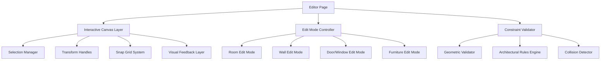

### Data Flow Architecture

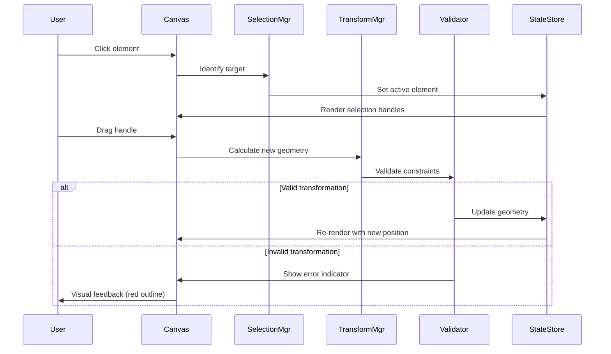

---

## Interactive Editing System

### 1. Selection and Interaction Model

#### Element Selection Strategy

| Interaction | Behavior | Visual Feedback |
|-------------|----------|-----------------|
| Click on room | Select room, show resize handles | Blue outline, 8 corner/edge handles |
| Click on wall | Select wall, show endpoints | Highlighted wall, 2 endpoint circles |
| Click on door/window | Select opening, show rotation handle | Orange outline, rotation arc |
| Click on furniture | Select item, show move/rotate handles | Green outline, position + rotation handles |
| Click empty space | Deselect all | Clear all highlights |
| Shift + Click | Multi-select elements | All selected show outlines |

#### Cursor States

| Mode | Default Cursor | Hover Cursor | Drag Cursor |
|------|---------------|--------------|-------------|
| Selection | `default` | `pointer` | `pointer` |
| Room Resize | `default` | `nwse-resize` / `nesw-resize` / `ew-resize` / `ns-resize` | Same as hover |
| Wall Drag | `default` | `move` | `grabbing` |
| Door Rotate | `default` | `crosshair` | `crosshair` |
| Furniture Move | `default` | `grab` | `grabbing` |

### 2. Transform Handle System

#### Room Transform Handles

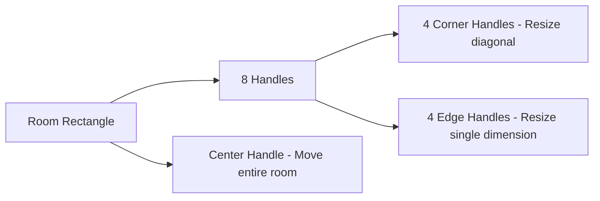

**Handle Specifications:**

| Handle Position | Action | Constraint |
|----------------|--------|------------|
| Top-left corner | Resize width + height maintaining opposite corner | Min room area: 4m² |
| Top-right corner | Resize width + height maintaining opposite corner | Aspect ratio: 1:3 to 3:1 |
| Bottom-left corner | Resize width + height maintaining opposite corner | Snap to grid: 0.1m |
| Bottom-right corner | Resize width + height maintaining opposite corner | No overlap with other rooms |
| Top edge center | Resize height only | Min height: 2m |
| Bottom edge center | Resize height only | Max height: 10m |
| Left edge center | Resize width only | Min width: 2m |
| Right edge center | Resize width only | Max width: 15m |

#### Wall Transform Handles

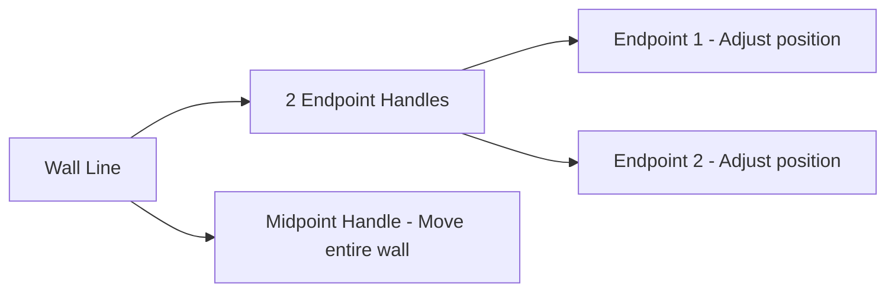

**Wall Editing Constraints:**

- Endpoints must snap to room corners or other wall endpoints
- Minimum wall length: 1.5m
- Maximum wall length: 20m
- Wall thickness: Fixed at 0.2m (interior) or 0.3m (exterior)
- Must maintain connectivity: Endpoints must connect to valid junctions

#### Door/Window Rotation Handle

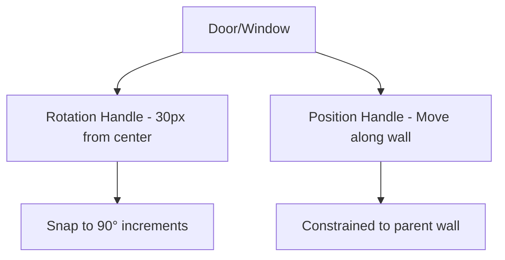

**Opening Editing Rules:**

- Rotation: Snap to 0°, 90°, 180°, 270°
- Position: Slide along parent wall only
- Clearance: Minimum 0.3m from wall endpoints
- Door swing: Must not overlap with adjacent walls
- Window height: Fixed sill height at 0.9m

### 3. Snap and Grid System

#### Grid Configuration

| Grid Type | Spacing | Visibility | Usage |
|-----------|---------|------------|-------|
| Major Grid | 1.0m | Faint gray lines (#E0E0E0) | Structural alignment |
| Minor Grid | 0.1m | Subtle dots (#F5F5F5) | Precise positioning |
| Magnetic Snap | 0.05m threshold | Invisible | Auto-align to grid |

#### Snap Targets

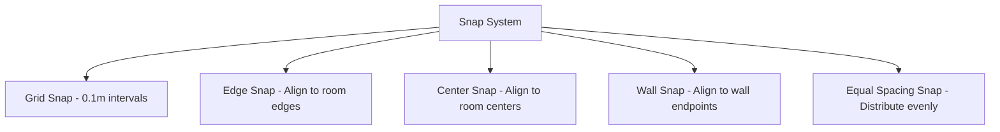

**Snap Priority (highest to lowest):**

1. Wall endpoint junctions (critical for structural integrity)
2. Room corner alignment
3. Grid major lines (1m intervals)
4. Room center alignment
5. Grid minor lines (0.1m intervals)

### 4. Visual Feedback Layer

#### Real-Time Feedback Elements

| Edit Action | Visual Indicator | Color Code | Animation |
|-------------|-----------------|------------|-----------|
| Valid move | Dashed blue outline | `#3B82F6` | Smooth follow |
| Invalid move | Dashed red outline + X icon | `#EF4444` | Shake on constraint violation |
| Snap active | Yellow highlight line | `#FBBF24` | Pulse 0.3s |
| Dimension display | Floating label with measurement | `#1F2937` on `#FFFFFF` | Fade in/out |
| Collision warning | Overlapping area shaded | `#EF4444` at 30% opacity | Flash 0.5s |

#### Dimension Labels

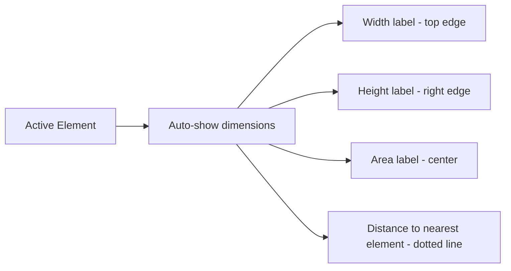

**Label Format:**

- Width/Height: `"12.5m"` (1 decimal precision)
- Area: `"45.3 m²"` (1 decimal precision)
- Distance: `"2.1m"` with dotted line to reference point

---

## Edit Modes and Workflows

### Mode 1: Room Editing

#### User Interaction Flow

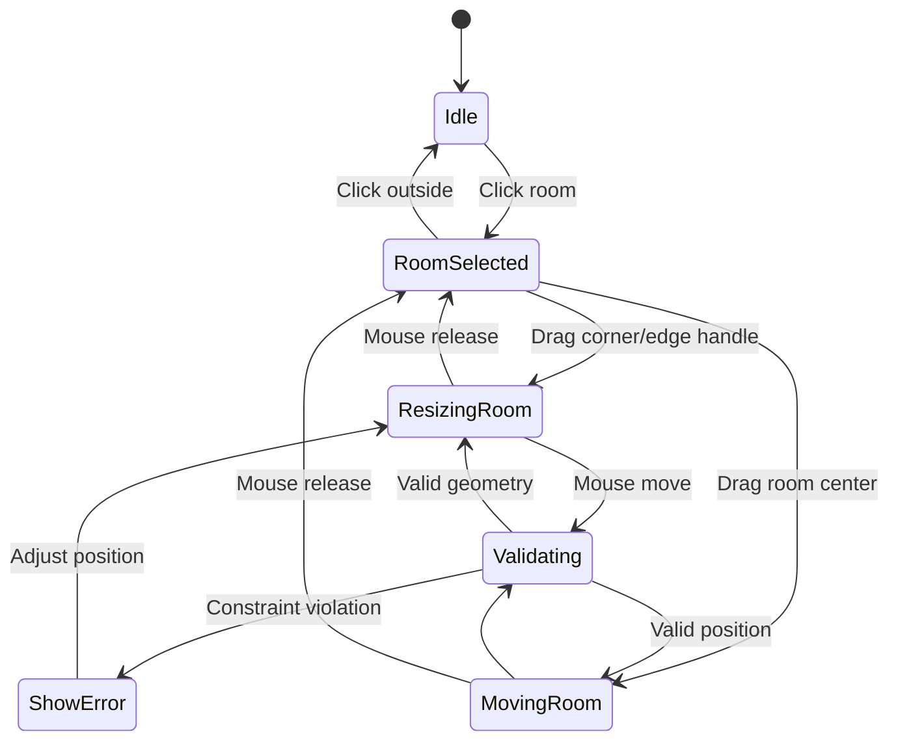

#### Room Edit Capabilities

| Capability | Input Method | Result |
|------------|--------------|--------|
| Resize room | Drag corner handle diagonally | Adjust width and height simultaneously |
| Change width | Drag left/right edge handle horizontally | Modify width while maintaining height |
| Change height | Drag top/bottom edge handle vertically | Modify height while maintaining width |
| Move room | Drag anywhere inside room (not on handle) | Translate entire room to new position |
| Rotate room | Shift + drag corner handle | Rotate in 90° increments (optional) |
| Rename room | Double-click room label | Open inline text editor |
| Change room type | Right-click → context menu | Convert to different room type (updates furniture) |

### Mode 2: Wall Editing

#### Wall Manipulation Model

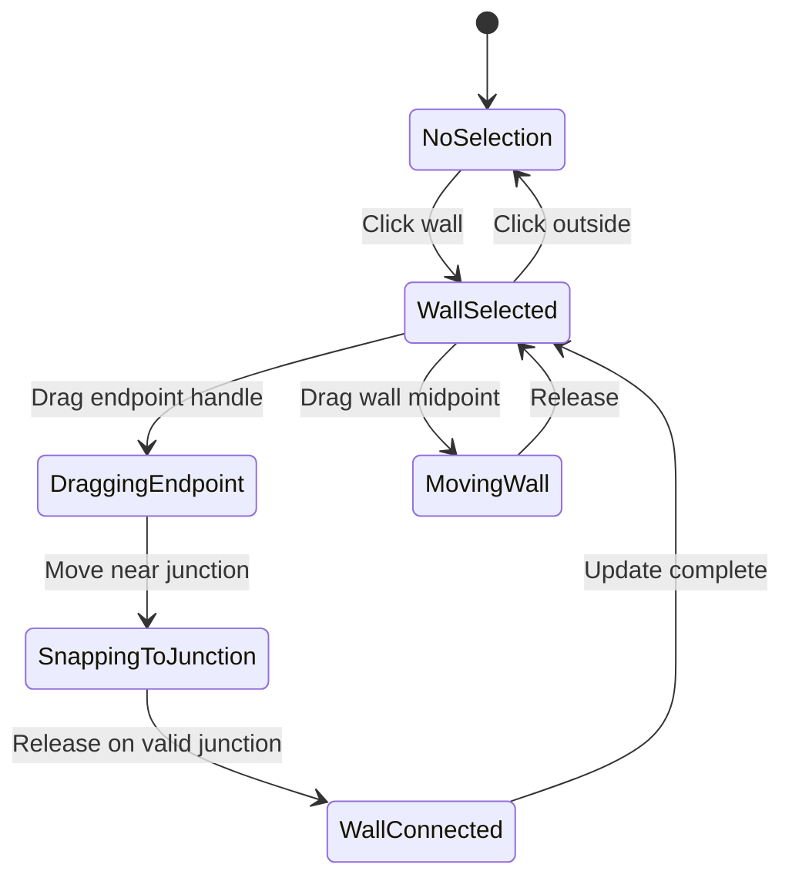

#### Wall Edit Operations

| Operation | Constraint | Validation Rule |
|-----------|------------|-----------------|
| Move wall endpoint | Must connect to room corner or wall junction | Auto-snap within 0.2m |
| Create wall branch | Drag from existing wall midpoint | Creates T-junction |
| Delete wall | Select wall + Delete key | Only if not load-bearing (interior wall) |
| Split wall | Ctrl + Click on wall | Inserts new junction point |
| Adjust wall thickness | Right-click → properties | Interior: 0.15-0.25m, Exterior: 0.25-0.40m |

### Mode 3: Door and Window Editing

#### Opening Interaction Model

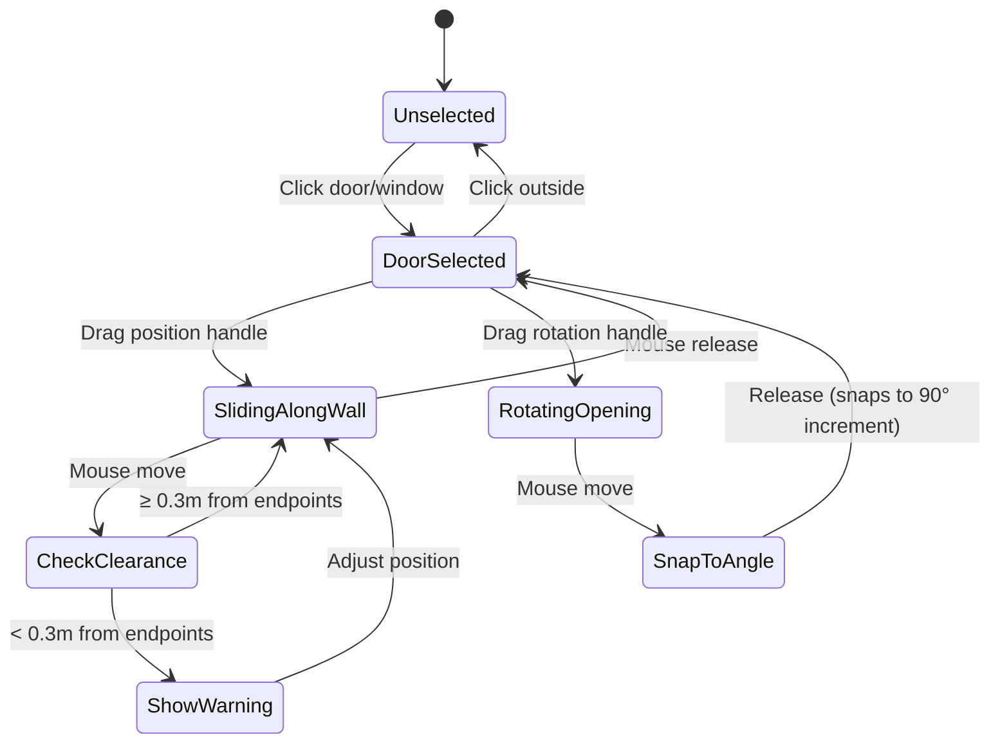

#### Opening Edit Rules

| Element | Editable Properties | Constraints |
|---------|-------------------|-------------|
| Door | Position along wall, rotation (swing direction), width | Width: 0.7-1.2m, clearance: 0.3m from corners, swing must not hit adjacent walls |
| Window | Position along wall, width, sill height | Width: 0.6-3.0m, sill height: 0.7-1.2m, clearance: 0.5m from corners |
| Entry Door | Position, rotation | Must be on exterior wall, width: 0.9-1.2m, accessible from outside |

### Mode 4: Furniture Editing

#### Furniture Manipulation

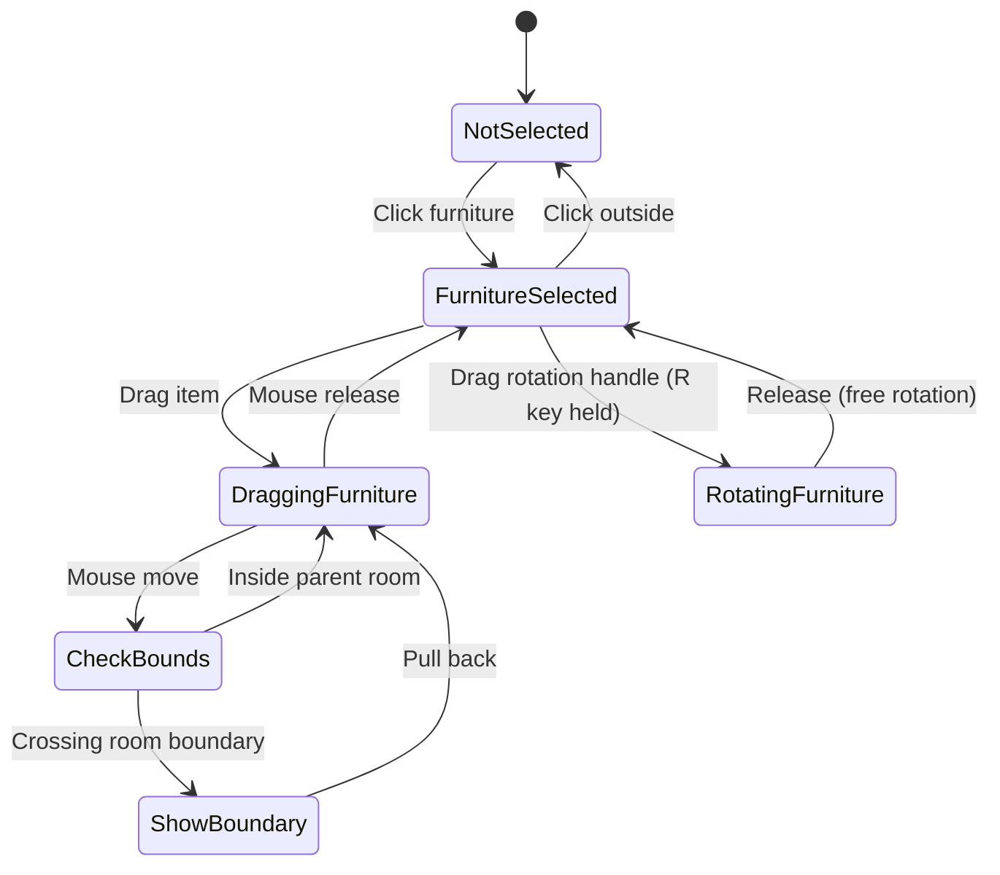

#### Furniture Edit Features

| Feature | Interaction | Constraint |
|---------|-------------|------------|
| Move furniture | Drag item | Must remain within parent room boundaries |
| Rotate furniture | R key + drag | Free rotation (0-360°) or snap to 45° increments (Shift held) |
| Resize furniture | Drag corner handle (proportional) | Min: 50% of default, Max: 150% of default |
| Change furniture type | Right-click → replace with... | Updates to new type with similar footprint |
| Delete furniture | Select + Delete key | Removes from room |
| Duplicate furniture | Ctrl + drag | Creates copy with same properties |

---

## State Management

### Editable Floor Plan State Schema

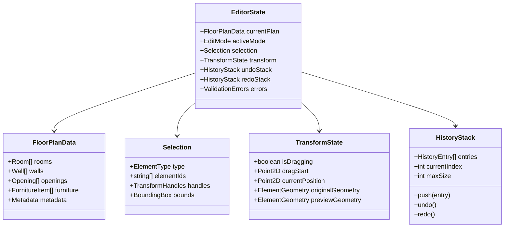

### State Update Pattern

| User Action | State Updates | Side Effects |
|-------------|--------------|--------------|
| Start drag | `transform.isDragging = true`, store `originalGeometry` | Show transform handles |
| Drag move | Update `previewGeometry` | Validate + render preview |
| Drag end | Commit `previewGeometry` to `currentPlan`, push to `undoStack` | Clear preview, re-render |
| Undo (Ctrl+Z) | Pop from `undoStack`, restore previous state | Re-render canvas |
| Redo (Ctrl+Y) | Pop from `redoStack`, restore forward state | Re-render canvas |

### Undo/Redo System

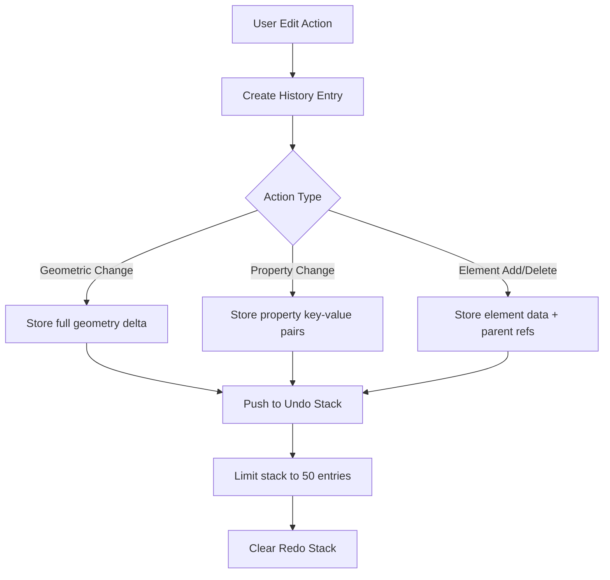

**History Entry Schema:**

| Field | Type | Description |
|-------|------|-------------|
| `timestamp` | ISO string | When action occurred |
| `actionType` | enum | "move", "resize", "rotate", "add", "delete", "modify" |
| `elementType` | enum | "room", "wall", "door", "window", "furniture" |
| `elementId` | string | Unique identifier |
| `before` | JSON | Previous state |
| `after` | JSON | New state |
| `description` | string | Human-readable description (e.g., "Resized Living Room") |

---

## Constraint Validation System

### Validation Pipeline

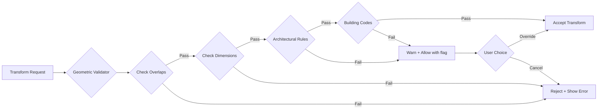

### Validation Rules Table

| Rule Category | Validation | Severity | Error Message |
|--------------|------------|----------|---------------|
| **Geometric** | No room overlaps | Error | "Room overlaps with {room_name}" |
| **Geometric** | No furniture outside room | Error | "Furniture must stay within room boundaries" |
| **Geometric** | Wall endpoints connect | Error | "Wall endpoint must connect to junction" |
| **Dimensional** | Room area ≥ 4m² | Error | "Room too small (min 4m²)" |
| **Dimensional** | Room aspect ratio 1:3 to 3:1 | Warning | "Room proportions may be impractical" |
| **Dimensional** | Door clearance ≥ 0.3m | Error | "Door too close to corner" |
| **Architectural** | Bathroom has door | Warning | "Bathroom should have a door for privacy" |
| **Architectural** | Kitchen near dining area | Warning | "Kitchen typically adjacent to dining room" |
| **Building Code** | Min corridor width 1.0m | Warning | "Corridor narrower than building code (1.0m)" |
| **Building Code** | Min 1 window per bedroom | Warning | "Bedroom requires natural light source" |

### Constraint Relaxation Strategy

When strict validation prevents edits:

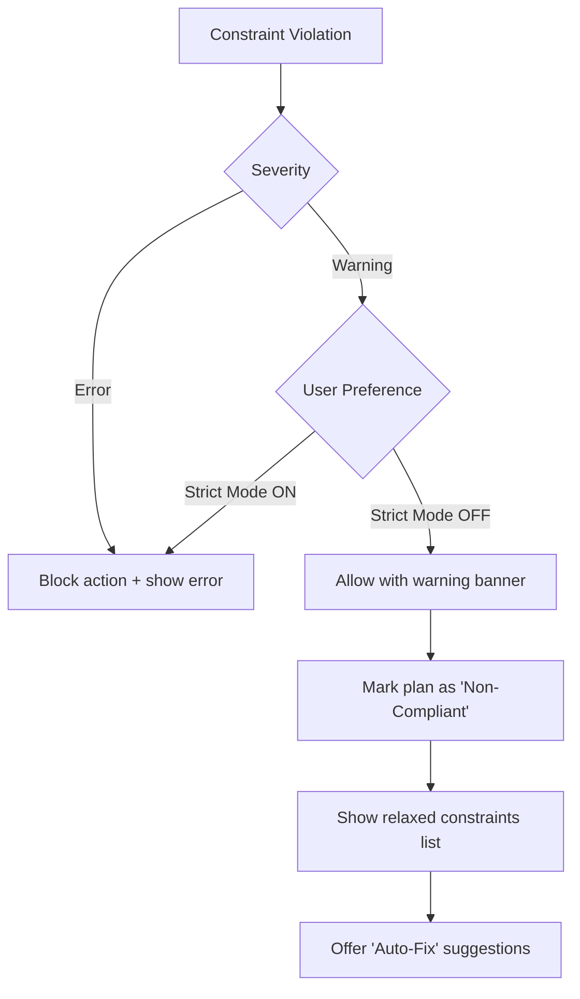

**Auto-Fix Suggestions:**

| Violation | Auto-Fix Action |
|-----------|-----------------|
| Room too small | Suggest minimum dimensions (show blue ghost outline) |
| Room overlap | Snap to non-overlapping position (nearest valid position) |
| Door swing collision | Rotate door to opposite direction |
| Missing window | Suggest window placement on exterior wall |
| Narrow corridor | Widen by reducing adjacent room sizes proportionally |

---

## Rendering and Performance

### Canvas Layer Architecture

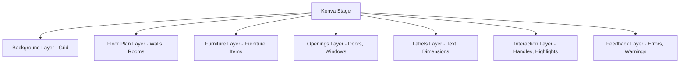

**Layer Rendering Order (bottom to top):**

1. Background: Grid lines and canvas background
2. Floor Plan: Walls (thick black lines), room fills (white)
3. Furniture: Geometric shapes representing furniture
4. Openings: Doors (arcs), windows (thick lines)
5. Labels: Room names, dimensions, areas
6. Interaction: Transform handles, selection outlines
7. Feedback: Error indicators, snap guides, dimension tooltips

### Performance Optimizations

| Optimization | Strategy | Impact |
|--------------|----------|--------|
| **Selective Rendering** | Only re-render changed layers | 60% faster updates |
| **Handle Virtualization** | Show handles only for selected elements | Reduced DOM nodes |
| **Throttled Validation** | Validate on drag end, not every mouse move | 80% less CPU usage |
| **Spatial Indexing** | Use R-tree for collision detection | O(log n) overlap checks |
| **Canvas Caching** | Cache static layers (walls, rooms) as bitmap | 50% faster zoom/pan |
| **Debounced Label Updates** | Update dimension labels 100ms after drag stops | Smoother dragging |

### Interaction Performance Targets

| Metric | Target | Measurement |
|--------|--------|-------------|
| Selection response time | < 50ms | Click to highlight |
| Drag frame rate | ≥ 60 FPS | Smooth visual feedback |
| Validation delay | < 100ms | Transform validation |
| Undo/redo action | < 30ms | State restoration |
| Auto-save trigger | Every 5s or 10 actions | Background save |

---

## Technology Stack

### Frontend Components

| Component | Library | Version | Purpose |
|-----------|---------|---------|---------|
| Canvas Rendering | react-konva | 18.x | 2D interactive canvas with event handling |
| Shape Primitives | konva | 9.x | Low-level canvas drawing API |
| State Management | zustand | 4.x | Lightweight global state for editor |
| Gesture Handling | use-gesture | 10.x | Advanced drag/pinch/rotate gestures |
| Spatial Indexing | rbush | 3.x | R-tree for fast collision detection |
| Undo/Redo | immer + zustand-middleware-immer | Latest | Immutable state history |

### Data Structures

#### R-Tree Spatial Index

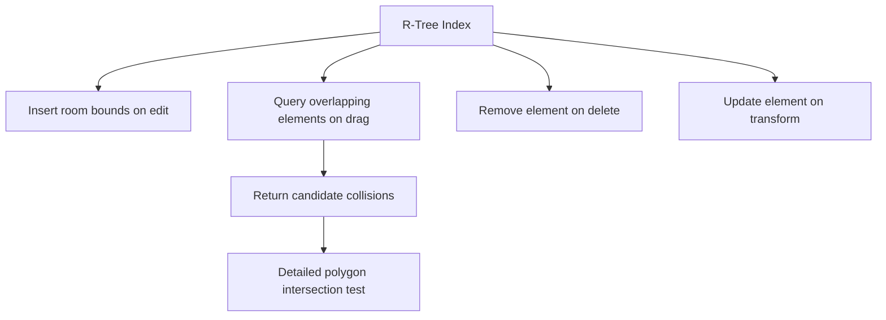

**Index Update Strategy:**

- Rebuild index on: Room add/delete, room resize
- Incremental update on: Room move, wall adjust
- Query on: Every drag move event (throttled to 60 FPS)

#### Geometry Utilities

| Utility Function | Input | Output | Usage |
|-----------------|-------|--------|-------|
| `pointInPolygon` | Point, Polygon vertices | boolean | Check if click is inside room |
| `lineIntersection` | Line1, Line2 | Point or null | Detect wall crossing |
| `boundingBox` | Element geometry | Rectangle | Calculate selection bounds |
| `closestPointOnLine` | Point, Line | Point | Snap to wall segment |
| `polygonIntersection` | Polygon1, Polygon2 | boolean | Check room overlap |
| `distanceToSegment` | Point, LineSegment | number | Snap distance calculation |

---

## Integration with Existing System

### Compatibility with Current Architecture

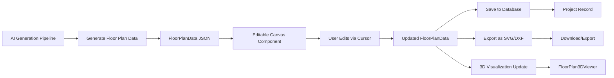

### Migration Path from Current Implementation

| Current Feature | Enhanced with Cursor Editing | Migration Strategy |
|----------------|------------------------------|-------------------|
| Static canvas rendering | Add interactive layer with handles | Overlay interaction layer on existing canvas |
| Advanced Edit panel (form-based) | Keep as fallback + add direct manipulation | Dual input: form OR drag handles |
| Zoom/pan controls | Maintain existing implementation | No change (independent from editing) |
| 3D viewer | Auto-update on edit commit | Listen to state changes, re-render 3D |
| SVG export | Export edited geometry | Update exporter to use live state |

### State Synchronization

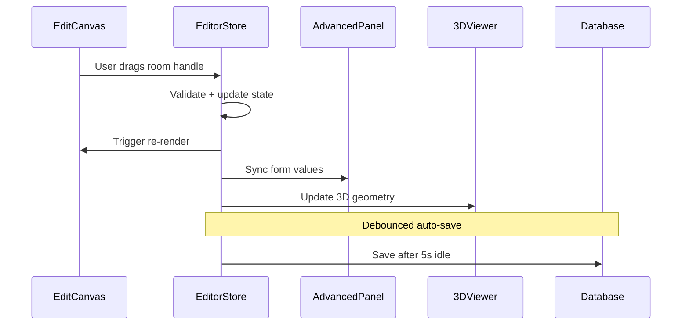

**Sync Events:**

- **Canvas → Store**: Mouse events, transform actions
- **Store → Canvas**: Geometry updates, validation errors
- **Store → Advanced Panel**: Selected element properties
- **Advanced Panel → Store**: Form input changes
- **Store → 3D Viewer**: Geometry changes (debounced 500ms)
- **Store → Database**: Auto-save (debounced 5s)

---

## User Experience Enhancements

### Keyboard Shortcuts

| Shortcut | Action | Mode |
|----------|--------|------|
| `Ctrl/Cmd + Z` | Undo last action | All modes |
| `Ctrl/Cmd + Y` | Redo action | All modes |
| `Delete` | Delete selected element | All modes |
| `Ctrl/Cmd + D` | Duplicate selected element | Room, Furniture |
| `Ctrl/Cmd + C` | Copy selected element | Room, Furniture |
| `Ctrl/Cmd + V` | Paste copied element | Room, Furniture |
| `Arrow Keys` | Nudge selected element 0.1m | Room, Wall, Furniture |
| `Shift + Arrow Keys` | Nudge selected element 1.0m | Room, Wall, Furniture |
| `R` (hold) | Enable rotation mode | Furniture |
| `G` | Toggle grid visibility | All modes |
| `Shift` (hold) | Disable snapping | All modes |
| `Esc` | Deselect all | All modes |

### Context Menus

#### Room Context Menu

| Menu Item | Action |
|-----------|--------|
| Rename Room | Open inline text editor |
| Change Room Type | Submenu: Bedroom, Bathroom, Kitchen, etc. |
| Duplicate Room | Create copy at offset position |
| Split Room | Add dividing wall |
| Merge with Adjacent Room | Remove shared wall |
| Properties | Open property panel (dimensions, area, materials) |
| Delete Room | Remove room + connected walls |

#### Wall Context Menu

| Menu Item | Action |
|-----------|--------|
| Split Wall | Add junction point at click position |
| Convert to Door Opening | Replace wall segment with door |
| Convert to Window Opening | Replace wall segment with window |
| Make Load-Bearing | Toggle structural status (prevents deletion) |
| Wall Properties | Thickness, material, color |
| Delete Wall | Remove wall (if not load-bearing) |

### Tooltip System

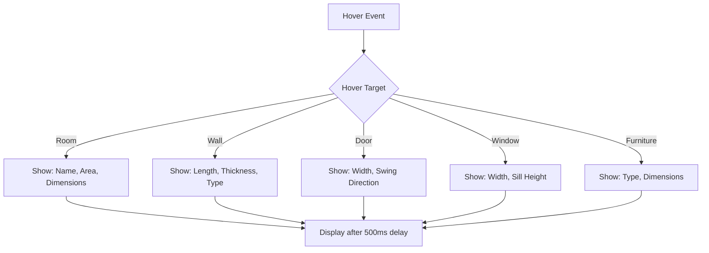

**Tooltip Content Examples:**

- **Room**: "Living Room | 45.2 m² | 7.5m × 6.0m"
- **Wall**: "Exterior Wall | 8.5m long | 0.30m thick"
- **Door**: "Entry Door | 1.0m wide | Swing: Inward"
- **Window**: "Window | 1.5m wide | Sill: 0.9m"
- **Furniture**: "Sofa | 2.1m × 0.9m"

---

## Testing Strategy

### Unit Tests

| Test Category | Test Cases | Validation |
|--------------|------------|------------|
| **Geometry Utilities** | Point in polygon, line intersection, bounding box | Correct mathematical calculations |
| **Constraint Validation** | Room overlap, dimension limits, wall connectivity | Rules enforced correctly |
| **Transform Logic** | Resize, move, rotate calculations | Correct coordinate transformations |
| **Snap System** | Grid snap, edge snap, junction snap | Snap to correct targets within threshold |
| **Undo/Redo** | Push, pop, clear history | State correctly restored |

### Integration Tests

| Test Scenario | Steps | Expected Result |
|--------------|-------|-----------------|
| **Edit and Save** | 1. Generate floor plan 2. Resize room 3. Save | Database updated with new geometry |
| **Undo/Redo Flow** | 1. Make 5 edits 2. Undo 3 times 3. Redo 2 times | State matches expected history position |
| **Validation Enforcement** | 1. Attempt invalid resize 2. System blocks action | Error shown, state unchanged |
| **Multi-Element Edit** | 1. Select multiple rooms 2. Move together | All elements move maintaining relative positions |
| **3D Sync** | 1. Edit room in 2D 2. Switch to 3D view | 3D view reflects 2D changes |

### Interaction Tests (Manual/Automated with Playwright)

| Interaction | Test Method | Pass Criteria |
|-------------|-------------|---------------|
| Click to select | Automated click event | Element highlighted, handles shown |
| Drag to resize | Automated drag simulation | Element resized, dimensions updated |
| Keyboard shortcuts | Automated key press | Correct action executed |
| Context menu | Automated right-click | Menu appears with correct options |
| Snap behavior | Automated drag near snap target | Element snaps to target |

---

## Implementation Phases

### Phase 1: Foundation (Week 1-2)

**Deliverables:**

- Selection system with single-element selection
- Basic transform handles for rooms (8 resize handles)
- Grid rendering and snap-to-grid functionality
- State management setup with Zustand
- Undo/redo infrastructure

**Acceptance Criteria:**

- User can click a room to select it
- User can drag corner handles to resize room
- Room snaps to grid lines while dragging
- Undo/redo works for resize actions

### Phase 2: Core Editing (Week 3-4)

**Deliverables:**

- Wall endpoint dragging
- Door/window position and rotation editing
- Furniture drag-and-drop
- Real-time dimension labels
- Constraint validation (overlaps, dimensions)

**Acceptance Criteria:**

- User can reposition wall endpoints with snap
- User can slide doors along walls
- User can move furniture within room boundaries
- System prevents invalid transformations

### Phase 3: Advanced Features (Week 5-6)

**Deliverables:**

- Multi-select and group transformations
- Context menus for all element types
- Keyboard shortcuts
- R-tree spatial indexing for performance
- Visual feedback layer (error indicators, snap guides)

**Acceptance Criteria:**

- User can select and move multiple rooms together
- Right-click menus provide relevant actions
- Keyboard shortcuts work as documented
- Drag performance maintains 60 FPS

### Phase 4: Integration and Polish (Week 7-8)

**Deliverables:**

- Sync with Advanced Edit panel (form inputs)
- 3D viewer auto-update on edits
- Auto-save with debouncing
- Export edited plans to SVG/DXF
- Comprehensive testing suite

**Acceptance Criteria:**

- Form panel reflects selected element properties
- 3D view updates within 500ms of edit
- Changes auto-save after 5 seconds idle
- Exported files match edited geometry
- All tests pass

---

## Alternative Approaches Considered

### Approach A: Form-Based Editing Only (Current Implementation)

**Pros:**
- Precise numeric input
- No complex canvas interactions
- Simpler to implement

**Cons:**
- Not intuitive for spatial design
- Slow workflow (type coordinates)
- Disconnected from visual representation

**Decision:** Rejected - Poor UX for architectural design tasks

---

### Approach B: Full CAD-Style Editor (Heavyweight Solution)

**Pros:**
- Professional-grade tools
- Advanced features (layers, dimensioning, constraints)
- Industry-standard workflows

**Cons:**
- Very complex implementation (months of work)
- Steep learning curve
- Overkill for target users (non-architects)

**Decision:** Rejected - Over-engineered, doesn't fit product vision

---

### Approach C: Hybrid: Direct Manipulation + Form Panel (Recommended)

**Pros:**
- Intuitive visual editing via cursor
- Precise control via form inputs when needed
- Familiar to design tool users (Figma, Canva)
- Balances ease-of-use and power

**Cons:**
- Moderate complexity to implement
- Requires careful state synchronization

**Decision:** Selected - Best balance of usability and development effort

---

### Approach D: AI-Assisted Editing (Future Enhancement)

**Concept:**
- User describes desired changes in natural language
- AI interprets intent and suggests transformations
- User approves/refines suggestions

**Example:**
- User: "Make the living room bigger"
- AI: Resizes living room, adjusts adjacent walls
- User: Drags handles to fine-tune

**Decision:** Deferred to future iteration - Requires LLM integration for spatial reasoning
